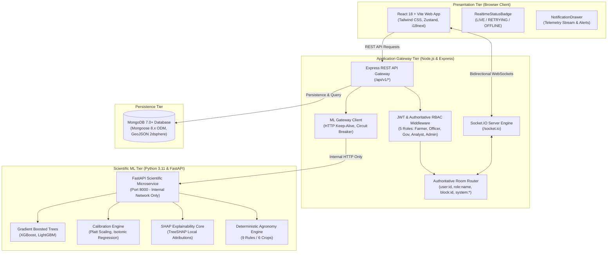

# VarshaSetu (वर्षासेतु)
> *Evidence-aware agro-meteorological intelligence and probabilistic decision-support platform.*

[](LICENSE)
[](#testing)
[](#technology-stack)
[](#current-scientific-scope)

---

## Product Overview

**VarshaSetu (वर्षासेतु)** is an evidence-aware agro-meteorological intelligence and scientific decision-support platform engineered to transform raw meteorological observations, ensemble climate downscaling, calibrated probabilistic forecasts, and crop-phenology risk models into explainable decision support for farmers, agricultural extension officers, government disaster authorities, and climate research analysts.

Operating at administrative block and Gram Panchayat resolutions across India, VarshaSetu bridges the divide between continental-scale atmospheric circulation and localized, on-the-ground agricultural risk management.

---

## Core Principle

### One Scientific Layer → Four Operational Perspectives

VarshaSetu operates on a strict separation between core scientific computation and role-specific operational projection:

$$\text{ONE SCIENTIFIC LAYER} \longrightarrow \text{FOUR OPERATIONAL PERSPECTIVES} \; (+\; \text{ADMIN})$$

The scientific intelligence layer computes probabilistic models, calibration reliability curves, SHAP feature attributions, and phenological risk gates once. Four distinct operational perspectives then project this single source of truth according to domain needs:

1. **Farmer Perspective:** Hyper-localized, 7–30 day probabilistic rainfall and dry-spell risk horizons, crop-stage agronomic advisories, and what-if sowing scenario simulations in Hindi and English.
2. **Field Officer Perspective:** Spatial cluster heatmaps, automated weather station (AWS) ground-truth verification, KVK agromet bulletin authoring, and extension event tracking.
3. **Government Perspective:** Regional vulnerability matrices, rainfall departure tracking, early disaster watch/warning signals, and contingency planning oversight.
4. **Climate Analyst Perspective:** Interactive probabilistic inference workbench, multi-model benchmark comparisons (XGBoost, LightGBM, Random Forest, Logistic Baseline), Platt/Isotonic calibration curves, and multi-year hindcast validation.
5. **System Administrator:** Security governance, immutable audit logging, user role provisioning, and system telemetry monitoring.

---

## Why VarshaSetu

Smallholder rainfed agriculture in India faces escalating climate volatility. Standard weather forecasts often fail to provide actionable agricultural guidance due to four fundamental shortcomings:

1. **Deterministic False Certainty:** Presenting rainfall as a binary outcome ("rain expected tomorrow") conceals inherent atmospheric uncertainty, causing farmers to misjudge critical sowing and transplanting windows.
2. **Spatial Misalignment:** Synoptic district-level bulletins overlook local topographical micro-climates across administrative blocks and Gram Panchayats.
3. **Decoupled Agronomy:** Meteorological figures (e.g., $65\text{ mm}$ precipitation) are delivered without phenological growth context (e.g., $65\text{ mm}$ during paddy nursery vs. paddy harvesting).
4. **Opaque Provenance:** Black-box predictions provide extension officers and administrators with no auditable lineage, station backing, or calibration reliability records.

VarshaSetu bridges these gaps by anchoring forecasts in calibrated probability distributions, mapping moisture anomalies directly to crop phenology, and enforcing an end-to-end scientific provenance ledger.

---

## Scientific Evidence & Trust

Transparency and scientific accountability are core design requirements. VarshaSetu answers four foundational questions across every interface:

| Scientific Question | Operational Meaning | Implementation Component |
| :--- | :--- | :--- |
| **WHAT** is the system showing? | Calibrated event probability ($P(\text{event})$), uncertainty interval ($P_{10}–P_{90}$), climatological baseline departure, and risk category. | `ConfidenceIndicator`, `RiskDistribution` |
| **WHY** is the system showing this? | Non-causal atmospheric drivers (moisture convergence, synoptic wind vorticity, instability) with SHAP attribution weights. | `SignalExplanation` |
| **WHERE** did the data come from? | Observational lineage: IMD AWS stations, INSAT-3DR satellite, ERA5 reanalysis, spatial resolution ($5.5\text{ km}$), ingestion timestamp, and cryptographic dataset hash. | `ProvenanceDrawer` |
| **HOW CONFIDENT** should you be? | Empirical validation metrics: calibration curve (Platt/Isotonic), Expected Calibration Error ($ECE$), Brier Skill Score ($BSS$), and sample verification count ($N$). | `ScientificEvidencePanel` |

### Probability is NOT Confidence
- **Probability ($P \in [0, 1]$):** Represents the modeled meteorological likelihood of an event occurring (e.g., $72\%$ chance of exceeding $64.5\text{ mm}$ rainfall).
- **Confidence (`PASS` / `MARGINAL` / `FAIL`):** Represents the empirical verification and calibration reliability of the underlying model against historical observational holdouts.

The application never combines these distinct dimensions into a single misleading score.

---

## Current Scientific Scope

The current platform demonstration operates under explicit scientific guardrails:

- **Observational Demonstration Anchor:** Centered on **Bakshi Ka Talab (`UP_LKO_BKT`)**, Lucknow District, Uttar Pradesh ($26.9749^\circ\text{N}, 80.9276^\circ\text{E}$).
- **Empirical Baseline:** Calibrated against the single-season **Kharif 2024** observational record (122 daily station and reanalysis records).
- **Operational Mode:** **`DIAGNOSTIC_ONLY`**. The system is explicitly configured to prevent unsupported multi-year operational claims until multi-season empirical telemetry is ingested.
- **Multi-Year Hindcast Gate:** Set to **`INSUFFICIENT_DATA`**. Evaluated models pass statistical calibration within the single-season baseline but are barred from multi-season operational deployment.

---

## Key Capabilities

- **Probabilistic Precipitation & Dry-Spell Forecasting:** Multi-horizon forecast generation (7, 14, 21, and 30 days) with uncertainty quantiles ($P_{10}, P_{50}, P_{90}$).
- **Crop-Phenology Risk Engine:** Agronomic rules mapping precipitation anomalies to Paddy, Maize, Mustard, Wheat, and Potato across nursery, tillering, flowering, and maturity stages.
- **What-If Scenario Simulator:** Interactive sensitivity workbench modeling the agro-meteorological effects of sowing shifts (delay by $+7$ to $+21$ days) without claiming biological yield or commercial prediction.
- **SHAP Feature Importance Attribution:** Local TreeSHAP attribution grouping features into physical domains (Moisture, Synoptic Wind, Thermodynamic Instability, Antecedent Rain).
- **Multi-Model Calibration Framework:** Comparative Platt Scaling and Isotonic Regression evaluating Brier Skill Scores and Expected Calibration Errors across XGBoost, LightGBM, Random Forest, and Logistic models.
- **Real-Time Event Synchronization:** WebSocket-based operational event broadcasting, auto-reconnection, and deduplicated event buffers.
- **Granular RBAC & Persona Routing:** Role-specific layouts and navigational boundaries for Farmer, Field Officer, Government, Analyst, and Admin roles.
- **Bilingual Accessibility:** English and Hindi localization with accessible screen-reader semantics and audio synthesis fallback.
- **Immutable Audit Logging:** Cryptographically traced operational and administrative event records.

---

## Architecture

The system follows a three-tier decoupled MERN + FastAPI architecture. The browser client **never** communicates directly with the Python ML service:



### Architectural Guardrails
1. **Zero Browser-to-FastAPI Bypass:** The React client possesses no network path to FastAPI (`localhost:8000`). All scientific inference passes through the Express API Gateway.
2. **No Numerical ML in Node.js:** Algorithmic forecasting, SHAP values, Platt scaling, and tree models reside exclusively in the Python scientific runtime. Express orchestrates, validates, and persists.
3. **Database Authorization:** MongoDB operations run through authoritative Mongoose models. RBAC is verified on the server side prior to query execution.

---

## Technology Stack

### Frontend Client
- **Framework:** React 18.3, Vite 5.x, TypeScript 5.x
- **Styling:** Tailwind CSS (Neo-brutalist Climate Intelligence Editorial Theme)
- **State Management:** Zustand (Stores: `useAppStore`, `useAuthStore`, `useFarmerStore`, `useOfficerStore`, `useRealtimeStore`)
- **Networking:** Axios HTTP client, Socket.IO Client 4.8
- **Mapping & GIS:** Leaflet 1.9, React-Leaflet
- **Localization:** i18next, react-i18next (English & Hindi)
- **Testing:** Vitest, React Testing Library, jsdom

### Application Gateway
- **Runtime:** Node.js (>= 20.0.0 LTS), Express 4.x, TypeScript 5.x
- **Real-Time Engine:** Socket.IO Server 4.8
- **Database ODM:** Mongoose 8.x
- **Security:** JSON Web Tokens (`jsonwebtoken`), bcryptjs, Helmet, express-rate-limit, Zod
- **Testing:** Vitest, Supertest

### Scientific ML Microservice
- **Runtime:** Python 3.11, FastAPI, Uvicorn
- **Machine Learning:** LightGBM, XGBoost, Scikit-learn
- **Explainability:** SHAP (TreeExplainer)
- **Scientific Computing:** NumPy, Pandas, SciPy, NetCDF4
- **Testing:** Pytest, HTTPX

### Database & Storage
- **Primary Database:** MongoDB 7.0+ (GeoJSON `2dsphere` spatial indexing, 16 collections, schema validations)
- **Legacy Fallback:** PostgreSQL 16 + PostGIS (Retained for migration compatibility and rollback resilience)

---

## Data Architecture

The persistence tier consists of 16 structured collections in MongoDB:

```
mongodb://localhost:27017/varshasetu
├── users                    # User identity, credentials, roles, permissions, block assignments
├── geography                # State, district, block, gram panchayat hierarchies
├── stations                 # IMD AWS ground telemetry stations with GeoJSON coordinates
├── telemetry                # Daily observed weather parameters (rainfall, temp, humidity, wind)
├── forecasts                # Probabilistic forecast snapshots (P10, P50, P90, probability, horizon)
├── forecast_runs            # Model execution metadata, pipeline latency, feature coverage
├── events                   # Detected agro-meteorological risk events (heavy rain, dry spell)
├── advisories               # Phenological crop advisories with severity and dismissal status
├── crops                    # Agronomic crop catalogs and growth stage threshold definitions
├── scenarios                # What-if sensitivity simulation contracts and calculated outcomes
├── models                   # Model family registry (XGBoost, LightGBM, RF, Logistic)
├── provenance               # Cryptographic data lineage, source hashes, station provenance
├── data_health              # Pipeline ingestion status, dataset freshness, record counts
├── notifications            # Unicast in-app delivery records and read receipts
├── localizations            # Multilingual advisory templates and voice manifests
└── audit_logs               # Immutable administrative and operational security logs
```

### GeoJSON Spatial Indexing
Administrative blocks and weather stations use GeoJSON `Point` and `Polygon` schemas indexed with `2dsphere`:
```typescript
coordinates: {
  type: { type: String, enum: ['Point'], required: true },
  coordinates: { type: [Number], required: true }, // [longitude, latitude]
}
```

---

## Security Architecture

- **Authentication:** Stateless JWT access tokens ($7\text{-day}$ default) coupled with rotating refresh tokens ($30\text{-day}$ validity) stored securely.
- **Handshake Verification:** Socket.IO connections require valid JWT credentials at connection handshake (`socketAuthMiddleware`).
- **Granular RBAC:** Five-tier authoritative role enforcement (`requireAuth`, `requireRole`, `requirePermission`) evaluated on the backend.
- **Authoritative Room Isolation:** Socket.IO join requests are validated on the server. Clients cannot join rooms for unauthorized roles or non-assigned geographic blocks.
- **Request Defense:** Strict Zod schema validation on API payloads, Helmet security headers (`X-Content-Type-Options`, `X-Frame-Options`), and IP-based rate limiting on sensitive routes.
- **Audit Immutability:** Audit records are append-only. No deletion endpoint exists for historical audit logs.
- **Sanitized Payloads:** Socket.IO DTOs and API responses strip internal MongoDB connection strings, internal service hostnames, and credentials.

---

## Real-Time Architecture

The real-time subsystem synchronizes platform state across clients using targeted room multicasting:

| Socket Event | DTO Type | Description | Target Channel |
| :--- | :--- | :--- | :--- |
| `event:created` | `ScientificEventDTO` | Newly detected meteorological risk event | `block:<id>`, `role:OFFICER`, `role:GOVERNMENT` |
| `event:updated` | `ScientificEventDTO` | State or parameter update on existing event | `block:<id>`, `role:OFFICER`, `role:GOVERNMENT` |
| `event:acknowledged`| `ScientificEventDTO` | Extension officer review and acknowledgment | `block:<id>`, `role:OFFICER`, `role:GOVERNMENT` |
| `event:resolved` | `ScientificEventDTO` | Resolution and closure of operational risk | `block:<id>`, `role:OFFICER`, `role:GOVERNMENT` |
| `forecast:updated` | `ForecastUpdatedDTO` | New multi-horizon model forecast run | `block:<id>`, `role:ANALYST`, `role:GOVERNMENT` |
| `advisory:updated` | `AdvisoryUpdatedDTO` | Modification or dismissal of crop advisory | `block:<id>`, `role:FARMER`, `role:OFFICER` |
| `data_health:updated`| `DataHealthUpdatedDTO`| Telemetry pipeline ingestion synchronization | `role:ANALYST`, `system:health` |
| `notification:new` | `InAppNotificationDTO` | Private in-app alert delivery | `user:<userId>` (Unicast) |
| `system:announcement`| `SystemAnnouncementDTO`| Global platform maintenance or warning | `system:announcements` (Broadcast) |

### Resilient Client Strategy
The frontend `socketClient` implements exponential backoff reconnection (10 attempts, 1s base delay, 10s maximum cap) and maintains a 50-item deduplicating ring buffer in `useRealtimeStore`.

---

## Operational Personas

| Persona | Primary Operational Purpose | Core System Capabilities |
| :--- | :--- | :--- |
| **Farmer** | Farm-level operational decisions and sowing window selection | 7–30 day calibrated forecasts, crop-specific phenology advisories, interactive What-If sowing simulator, Hindi/English translation, provenance drawers. |
| **Field Officer** | Extension advisory management and ground-truth verification | Block geospatial cluster monitoring, KVK advisory bulletin drafting and broadcasting, AWS ground-truth inspections, event acknowledgement. |
| **Government** | Regional disaster oversight and contingency planning | Statewide/district risk matrices, rainfall departure tracking, early warning triggers, telemetry uptime monitoring, policy intervention logs. |
| **Climate Analyst** | Meteorological model verification and calibration research | Probabilistic forecast lab, multi-model benchmark comparisons, Platt/Isotonic calibration curves, SHAP feature attributions, hindcast folds. |
| **Administrator** | System security, user access, and pipeline governance | User role provisioning, system status telemetry, immutable audit log inspection, cross-perspective diagnostics. |

---

## API Architecture

All Express REST endpoints (`/api/v1/*`) return a standardized response envelope:

### Success Envelope
```json
{
  "success": true,
  "data": { ... },
  "meta": {
    "requestId": "c768940a-1727-4b3f-8c1e",
    "timestamp": "2026-09-26T16:05:10.851Z"
  }
}
```

### Error Envelope
```json
{
  "success": false,
  "error": {
    "code": "FORBIDDEN",
    "message": "User does not have required permissions"
  },
  "meta": {
    "requestId": "d821ae40-2819-4a1b-9e2c",
    "timestamp": "2026-09-26T16:05:11.120Z"
  }
}
```

---

## Scientific Safety & Non-Fabrication

1. **Zero Fabrication Policy:** When telemetry parameters, observational metrics, or model outputs are absent from an ingestion run, the UI explicitly renders:
   ```
   "NOT CONFIGURED"  or  "NOT AVAILABLE IN CURRENT PIPELINE"
   ```
   Values are never synthetic placeholders disguised as verified observations.
2. **Non-Causal Diagnostic Disclaimer:** Feature attributions (SHAP) represent statistical correlation within the trained gradient-boosted tree models and do not assert physical atmospheric causality.
3. **No Commercial or Yield Predictions:** What-if simulations evaluate meteorological sensitivity only. The system does not claim to project crop yield, biomass, market prices, or revenue.
4. **No Procurement Terminology:** The platform contains zero commercial marketplace, procurement, mandi, crop-selling, weighing, queue, or payment mechanisms.

---

## Repository Structure

```
VarshaSetu/
├── backend/                         # Node.js + Express API Gateway
│   ├── src/
│   │   ├── config/                  # Database, environment, and security configs
│   │   ├── controllers/             # REST API business controllers
│   │   ├── db/                      # Database pool, migrations, and seed scripts
│   │   ├── middleware/              # requireAuth, requireRole, rateLimit, error handlers
│   │   ├── models/                  # 16 Mongoose document schemas & GeoJSON indexes
│   │   ├── realtime/                # Socket.IO server, handshake auth, rooms, events
│   │   ├── repositories/            # Data access repositories (MongoDB + fallback)
│   │   ├── routes/                  # Express route definitions (/api/v1/*)
│   │   ├── services/                # Business services, ML client proxy, audit logger
│   │   └── server.ts                # HTTP and Socket.IO server bootstrap
│   └── tests/                       # Vitest integration and unit test suites
│
├── frontend/                        # React 18 + Vite Web Application
│   ├── src/
│   │   ├── components/              # Modular UI, visualization, map, and layout components
│   │   │   ├── common/              # Navbar, RealtimeStatusBadge, NotificationDrawer
│   │   │   ├── farmer/              # Farmer forecast cards, advisory strips, what-if teaser
│   │   │   ├── maps/                # Leaflet choropleth maps, layer controls, legends
│   │   │   └── visualization/       # Triad metrics, ProvenanceDrawer, ConfidenceIndicator
│   │   ├── pages/                   # Persona views (Farmer, Officer, Government, Analyst, Admin)
│   │   ├── services/                # Axios API client, socketClient, domain services
│   │   ├── stores/                  # Zustand state stores
│   │   └── tests/                   # Vitest unit and integration test suites
│   └── vite.config.ts               # Vite bundler configuration with /api and /socket.io proxy
│
├── ml-service/                      # Python 3.11 Scientific ML Microservice
│   ├── app/
│   │   ├── agronomy/                # Phenology rules, crop stages, what-if simulator
│   │   ├── calibration/             # Platt Scaling and Isotonic Regression engines
│   │   ├── explainability/          # TreeSHAP feature importance computation
│   │   ├── models/                  # XGBoost, LightGBM, and Random Forest pipelines
│   │   ├── validation/              # Multi-year hindcasting validation gates
│   │   └── main.py                  # FastAPI application entrypoint
│   └── tests/                       # Pytest scientific test suite
│
└── docs/                            # Architectural specifications and audit ledgers
```

---

## Local Development Setup

### Prerequisites
- Node.js >= 20.0.0 LTS
- Python >= 3.11
- MongoDB >= 7.0 (running locally on port 27017)
- PostgreSQL 16 (optional, legacy fallback)

### 1. Clone & Configure Environment
```bash
git clone https://github.com/org/varshasetu.git
cd VarshaSetu

# Configure environment files from templates
cp .env.example .env
cp backend/.env.example backend/.env
cp frontend/.env.example frontend/.env
cp ml-service/.env.example ml-service/.env
```

### 2. Install Dependencies
```bash
# Backend dependencies
cd backend && npm install

# Frontend dependencies
cd ../frontend && npm install

# ML Service virtual environment and packages
cd ../ml-service
python3 -m venv venv
source venv/bin/activate
pip install -r requirements.txt
```

### 3. Seed Development Database
```bash
cd ../backend
npm run seed:mongo
```

### 4. Start Services
```bash
# Terminal 1: Scientific ML Service (Port 8000)
cd ml-service
source venv/bin/activate
uvicorn app.main:app --host 0.0.0.0 --port 8000 --reload

# Terminal 2: Node.js Express Gateway (Port 5001)
cd backend
npm run dev

# Terminal 3: React Frontend Client (Port 5173)
cd frontend
npm run dev
```
Open [http://localhost:5173](http://localhost:5173) in your browser.

---

## Development Demonstration Accounts

> **NOTICE:** The following credentials are provided strictly for **LOCAL DEVELOPMENT AND VERIFICATION ONLY**. They must never be deployed to staging or production environments.

| Operational Perspective | Email | Password | Assigned Location |
| :--- | :--- | :--- | :--- |
| **Farmer** | `ramesh.farmer@example.com` | `FarmerPassword123!` | Bakshi Ka Talab (`UP_LKO_BKT`) |
| **Field Officer** | `officer.lucknow@varshasetu.gov.in` | `OfficerPassword123!` | Lucknow District (`UP_LKO`) |
| **Government** | `planner.up@varshasetu.gov.in` | `GovPassword123!` | Uttar Pradesh State |
| **Climate Analyst** | `analyst.climate@varshasetu.gov.in` | `AnalystPassword123!` | Regional Climatology Center |
| **Administrator** | `admin@varshasetu.gov.in` | `AdminPassword123!` | System Universal Access |

---

## Testing & Quality Assurance

The codebase is continuously validated across all three architectural tiers:

```bash
# 1. Run Backend Integration & Unit Tests (167 Tests Passing across 16 Suites)
cd backend
npm test -- --run

# 2. Run Frontend Integration & Component Tests (117 Tests Passing across 21 Suites)
cd frontend
npm test -- --run

# 3. Run Scientific ML Microservice Tests (202 Tests Passing across 49 Suites)
cd ml-service
source venv/bin/activate
pytest

# 4. Production Build Verification
cd backend && npm run build
cd ../frontend && npm run build
```

**Total Automated Coverage:** **486 Automated Tests (100% Passing)** across the repository.

---

## Production Readiness Status

| Subsystem | Readiness Category | Verification Status | Notes |
| :--- | :--- | :--- | :--- |
| **MERN Architecture** | Implemented & Verified | Fully operational | Express gateway, MongoDB persistence, React Vite frontend. |
| **5-Role RBAC** | Implemented & Verified | Fully operational | Server-side role enforcement with URL-hopping protection. |
| **ML Service Gateway** | Implemented & Verified | Fully operational | Proxied through Express; zero direct browser exposure. |
| **Real-Time WebSockets**| Implemented & Verified | Fully operational | Handshake JWT auth, room segmentation, auto-reconnection. |
| **Scientific Trust Layer**| Implemented & Verified | Fully operational | Phase 9 WHAT, WHY, WHERE, HOW CONFIDENT audit components. |
| **Demonstration Scope** | Diagnostic Only | Strictly gated | Single-season Kharif 2024 anchor (`UP_LKO_BKT`). |
| **Multi-Year Hindcasting**| Requires Multi-Season Data | Gated (`INSUFFICIENT_DATA`)| Awaiting 10-year historical telemetry ingestion. |
| **Live AWS Feed** | Requires Infrastructure | Simulation / Reanalysis | Real-time IMD API ingestion requires live telemetry credentials. |
| **Telecom Dispatch** | Requires Carrier Setup | Mock / Gated | SMS and WhatsApp delivery disabled by default until configured. |

---

## Scientific Limitations

1. **Single-Season Baseline:** The current demonstration utilizes observations from Kharif 2024. Statistical models should not be considered operational for multi-season or winter (Rabi) forecasting without retraining.
2. **Spatial Extrapolation:** Empirical calibration is anchored to the Lucknow District (`UP_LKO_BKT`) centroid. Model performance may degrade if extrapolated outside the Indo-Gangetic alluvial plain without recalibration.
3. **Statistical vs. Dynamical:** Forecasts combine gradient-boosted tree downscaling with reanalysis fields; they are statistical downscalings, not coupled numerical weather prediction (NWP) integrations.

---

## Future Scope

- **Multi-Season Ingestion:** Ingesting 10+ years of gridded daily precipitation data to satisfy the multi-year hindcast validation gate.
- **Geographic Expansion:** Expanding calibration baselines to Maharashtra (Vidarbha), Karnataka (Dry Zone), and Punjab.
- **Live IMD AWS Integration:** Automated streaming ingestion from India Meteorological Department Automated Weather Station networks.
- **Offline PWA Capabilities:** Offline-first caching of block advisory cards with background synchronization for rural mobile networks.
- **Expanded Indian Languages:** Adding Marathi, Telugu, Punjabi, and Bengali localized advisory templates.

---

## License

This project is licensed under the MIT License — see the [LICENSE](LICENSE) file for details.

---

## Acknowledgements

- **India Meteorological Department (IMD):** Meteorological threshold standards and observational guidelines.
- **European Centre for Medium-Range Weather Forecasts (ECMWF):** ERA5 atmospheric reanalysis dataset references.
- **National Remote Sensing Centre (NRSC) / ISRO:** INSAT-3DR satellite meteorological data references.
