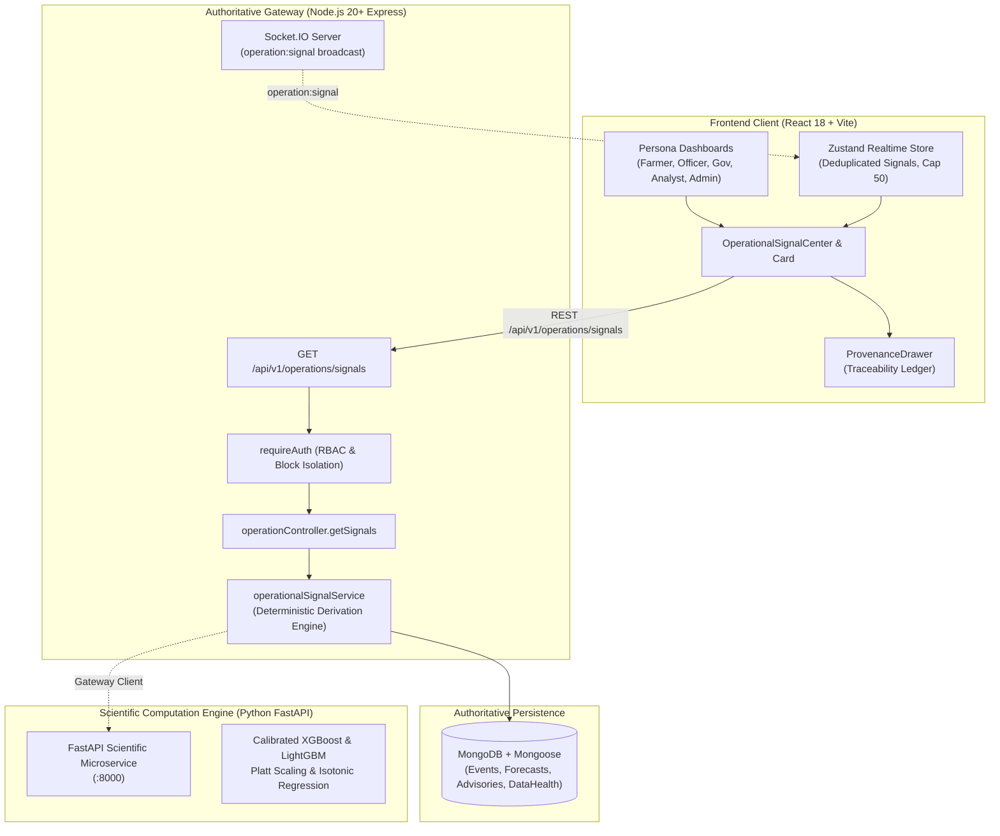

# VarshaSetu (वर्षासेतु) — Phase 7A: Operational Intelligence Foundation

**Status:** COMPLETE & LOCKED  
**Date:** September 2026  
**Architecture:** React 18 + Vite | Node.js Express REST API Gateway + Socket.IO | MongoDB + Mongoose | Python FastAPI Scientific ML Engine  
**Product Principle:** ONE SCIENTIFIC LAYER → FOUR OPERATIONAL PERSPECTIVES  

---

## 1. Executive Summary & Phase 7A Scope

Phase 7A establishes the **Operational Intelligence Foundation** for VarshaSetu. Prior phases completed the full architectural migration of persistence, APIs, ML gateways, realtime synchronization, and end-to-end verification. Phase 7A builds the first layer of operational intelligence on top of this verified foundation without changing the established MERN architecture.

### Objectives Achieved
1. **Authoritative Operational Signal Engine:** Built deterministic signal derivation in the Node.js Express authoritative layer (`backend/src/services/operational/`) synthesizing domain records (`Event`, `Forecast`, `Advisory`, `DataHealth`) and scientific verification gates.
2. **Strict Server-Side RBAC & Geographic Isolation:** Enforced role-based access control where Farmers and Field Officers are strictly bound to their assigned operational block (`UP_LKO_BKT`), while Government, Climate Analyst, and Admin roles receive regional multi-block clearance.
3. **Standardized Response Envelope & Query API:** Mounted `GET /api/v1/operations/signals` returning standardized envelopes with deterministic severity sorting, filtering, and pagination.
4. **Real-Time Reactive Streaming:** Integrated `operation:signal` event over Socket.IO with room-scoped dispatch (`block:<id>`, role rooms) and deduplication in the frontend Zustand store.
5. **Climate Intelligence Editorial UI:** Implemented `OperationalSignalCard` and `OperationalSignalCenter` adhering to the editorial typography, severity hierarchy, and full `ProvenanceDrawer` traceability.
6. **Cross-Persona Integration:** Embedded the signal center across all 5 user roles (Farmer, Field Officer, Government, Climate Analyst, Admin).
7. **Scientific Governance & Zero Fabrication:** Enforced strict `DIAGNOSTIC_ONLY` operational status, `INSUFFICIENT_DATA` validation gates for multi-year hindcasting, and honest `NOT AVAILABLE` / `NOT CONFIGURED` disclosures without fabrication.

---

## 2. Architecture Overview & Invariant Compliance



### Architectural Invariants Enforced
- **Zero Browser-to-FastAPI Calls:** React communicates exclusively with Express REST endpoints (`/api/v1/*`) and Socket.IO.
- **Express Authoritative Gateway:** All authentication, permission evaluation, geographic boundary enforcement, and signal aggregation occur inside Node.js Express.
- **Python ML Specialization:** ML inference, SHAP explanations, reliability curves, and downscaling algorithms remain isolated in Python FastAPI.
- **No Parallel Architectures:** Built directly onto existing controllers, routes, and stores.

---

## 3. Operational Signal Domain Model & Schema

The operational signal contract represents actionable intelligence derived deterministically from underlying meteorological events, forecasts, advisories, and system gates.

### Signal Schema (`OperationalSignalDTO`)

| Field | Type | Description |
|---|---|---|
| `signalId` | `string` | Unique deterministic identifier (e.g. `sig_evt_...`, `sig_fc_...`, `sig_gate_...`) |
| `signalType` | `OperationalSignalType` | One of `EVENT`, `FORECAST_CHANGE`, `ADVISORY`, `DATA_QUALITY`, `MODEL_STATUS`, `OPERATIONAL_GATE` |
| `title` | `string` | Short human-readable headline |
| `summary` | `string` | Detailed contextual description |
| `severity` | `SignalSeverity` | `CRITICAL` (4), `WARNING` (3), `WATCH` (2), `INFO` (1) |
| `blockId` | `string` | Spatial anchor (e.g. `UP_LKO_BKT`) |
| `detectedAt` | `string (ISO)` | Detection timestamp |
| `validFrom` | `string (ISO)` | Validity window start |
| `validUntil` | `string (ISO)` | Validity window expiration |
| `probability` | `number \| null` | Calibrated likelihood, or `null` if deterministic/not available |
| `confidenceStatus` | `string` | Calibration status (`CALIBRATED`, `PASS`, `MARGINAL`, `FAIL`, `NOT CONFIGURED`) |
| `operationalStatus` | `string` | Authoritative operational mode (`DIAGNOSTIC_ONLY`) |
| `dataFreshness` | `string` | Pipeline freshness (`HISTORICAL_ONLY`, `REALTIME`, `ARCHIVED`) |
| `validationStatus` | `string` | Gating status (`VALIDATED`, `INSUFFICIENT_DATA`, `EXPERIMENTAL`) |
| `sourceReferences` | `SignalSourceReference[]` | Traceability links to backing entities |
| `recommendedInspection` | `string?` | Concrete operational recommendation for field and extension personnel |

---

## 4. Authoritative Signal Derivation Pipeline

The `operationalSignalService` provides pure, deterministic transformers:
- **`fromEvent(event)`**: Maps meteorological event notices (Heavy Rain, Dry Spell, Cloudburst Risk) into signals. Probability preserves raw calibrated score; severity maps directly.
- **`fromForecast(forecast)`**: Evaluates precipitation and risk horizon transitions. Probability and horizon details are cleanly extracted.
- **`fromAdvisory(advisory)`**: Transforms extension bulletins (crop protection, drainage, moisture conservation) into actionable advisory signals.
- **`fromDataHealth(dataHealth)`**: Transforms telemetry pipeline degradation into system signals for analysts and administrators.
- **`getSystemGateSignals()`**: Emits authoritative system-level operational gates, notably enforcing single-season baseline boundaries (`INSUFFICIENT_DATA` for multi-year hindcasts).

---

## 5. Server-Side RBAC & Geographic Isolation

Access to operational signals is governed strictly on the server:

1. **Farmer Persona (`FARMER`):**
   - Automatically bounded to `assignedLocationId` (`UP_LKO_BKT`).
   - Querying any foreign `blockId` immediately returns `403 Forbidden` (`FORBIDDEN`).
   - Internal technical signals (`MODEL_STATUS`) are filtered out server-side.
2. **Field Officer Persona (`OFFICER`):**
   - Bounded to assigned administrative block or district jurisdiction.
   - Querying unassigned blocks returns `403 Forbidden`.
3. **Government (`GOVERNMENT`), Analyst (`CLIMATE_ANALYST`), Admin (`ADMIN`):**
   - Possess universal multi-block query clearance across all blocks.

---

## 6. Standardized Response Envelope & Query API

### Endpoint Specification
`GET /api/v1/operations/signals`

### Query Parameters
- `blockId` (`string`, optional): Target administrative block code.
- `severity` (`SignalSeverity`, optional): Filter by `CRITICAL`, `WARNING`, `WATCH`, `INFO`.
- `signalType` (`OperationalSignalType`, optional): Filter by signal category.
- `operationalStatus` (`string`, optional): Filter by operational mode.
- `limit` (`number`, optional, default 50, max 100): Pagination limit.

### Standard Response Envelope
```json
{
  "success": true,
  "data": {
    "items": [
      {
        "signalId": "sig_gate_multiyear_hindcast_insufficient",
        "signalType": "OPERATIONAL_GATE",
        "title": "Operational Gate: Single-Season Baseline Enforced",
        "summary": "Platform is strictly gated under DIAGNOSTIC_ONLY status...",
        "severity": "WATCH",
        "blockId": "UP_LKO_BKT",
        "detectedAt": "2024-07-01T00:00:00.000Z",
        "validFrom": "2024-07-01T00:00:00.000Z",
        "validUntil": "2024-10-31T23:59:59.000Z",
        "probability": null,
        "confidenceStatus": "PASS",
        "operationalStatus": "DIAGNOSTIC_ONLY",
        "dataFreshness": "ARCHIVED",
        "validationStatus": "INSUFFICIENT_DATA",
        "sourceReferences": [
          { "id": "GATE_MULTIYEAR_2024", "type": "OPERATIONAL_GATE", "label": "Kharif 2024 Gate" }
        ],
        "recommendedInspection": "Review multi-year hindcast cross-validation folds..."
      }
    ],
    "total": 1
  },
  "meta": {
    "requestId": "8fbc2594-5f53-48b4-82a1-638bc325ff40",
    "timestamp": "2026-09-26T16:25:20.798Z"
  }
}
```

---

## 7. Real-Time Socket.IO Synchronization

- **Event Name:** `operation:signal`
- **Emitter Method:** `realtimeService.emitOperationalSignal(signal)`
- **Room Targeting:**
  - `block:${signal.blockId}` — delivered to subscribed farmers and officers in the block.
  - `role:officer`, `role:government` — operational notifications for extension and planning.
  - `role:analyst`, `role:admin` — comprehensive operational and model status telemetry.
- **Frontend Reactive Store (`useRealtimeStore`):**
  - Deduplication: updates existing item in place if `signalId` matches; otherwise prepends new signal.
  - Ring buffer cap: maximum 50 recent signals maintained in memory.
  - Live sync indicator with glowing pulse status.

---

## 8. Frontend Architecture & Climate Intelligence Editorial UI

### Components Built
1. **`OperationalSignalCard.tsx`:**
   - Editorial styling matching the Climate Intelligence theme.
   - Severity badges with distinct iconography and accessible contrast ratios.
   - Scientific parameter grid: Probability, Confidence, Operational Mode, Data Freshness.
   - Traceability tags linking source entities.
   - Action buttons: "Evidence →" (opens `ProvenanceDrawer`) and "Inspect".
2. **`OperationalSignalCenter.tsx`:**
   - Active signal count pill with live connection sync indicator.
   - Category filter tabs (`All Signals`, `Events`, `Forecasts`, `Advisories`, `Gates & Quality`).
   - Severity filter dropdown (`All Severities`, `Critical Only`, `Warning`, `Watch`, `Info`).
   - Integrated `ProvenanceDrawer` modal providing deep traceability into observation sources, station count, calibrator type, and pipeline governance notes.

---

## 9. Persona Dashboard Integrations

| Persona | Page | Integration Mode |
|---|---|---|
| **Farmer** | `FarmerDashboardPage.tsx` | Filtered for `UP_LKO_BKT`, compact view, technical model status hidden |
| **Field Officer** | `OfficerDashboardPage.tsx` | Block-level extension signals embedded before spatial GIS map |
| **Government** | `GovernmentDashboardPage.tsx` | Regional executive signal center embedded before signal matrix |
| **Climate Analyst** | `AlertCenterPage.tsx` | Full operational signals & verification gates panel with inspection tools |
| **Admin** | `AdminDashboardPage.tsx` | System gate monitor and telemetry verification center |

---

## 10. Scientific Safeguards & Gating Semantics

1. **Probability vs. Confidence Distinction:**
   - Probability represents the raw calibrated model score (e.g. 78%).
   - Confidence represents statistical reliability (`CALIBRATED`, `PASS`, `MARGINAL`, `FAIL`, `NOT CONFIGURED`).
   - Signals never equate probability to confidence.
2. **Zero Fabrication:**
   - Missing probability on deterministic signals explicitly returns `null` and renders `NOT AVAILABLE`.
   - Unconfigured channels or unverified pipelines output `NOT CONFIGURED` or `INSUFFICIENT_DATA`.
3. **Single-Season Baseline Boundary:**
   - Platform operational state remains locked to `DIAGNOSTIC_ONLY`.
   - Multi-year hindcast validation gate reports `INSUFFICIENT_DATA` until at least 2 complete seasons are validated.

---

## 11. Test Coverage & Verification Results

### Complete Monorepo Test Results: 504 Passed (100%)

| Test Suite | Tests Passed | Status |
|---|---|---|
| **Backend Integration & Unit Tests** | **178 / 178** | PASSED (17 test files) |
| **Frontend Component & Integration Tests** | **124 / 124** | PASSED (22 test files) |
| **Python ML Scientific Verification** | **202 / 202** | PASSED (50 test files) |
| **Total Automated Tests** | **504 / 504** | **100% GREEN** |

### New Tests Added in Phase 7A
- `backend/tests/integration/operational_signals.test.ts` (+11 tests):
  - 401 unauthenticated rejection
  - 200 standard response envelope with meta
  - Farmer strict block isolation (`UP_LKO_BKT`) & 403 on foreign block
  - Field officer jurisdiction isolation
  - Admin universal clearance
  - Severity query filtering (`WARNING`)
  - Signal type query filtering (`OPERATIONAL_GATE`)
  - Deterministic severity-weighted sorting
  - `DIAGNOSTIC_ONLY` and `INSUFFICIENT_DATA` assertions
  - No fabrication of probabilities
  - Filtering of `MODEL_STATUS` from farmers
- `frontend/src/tests/OperationalSignalCenter.test.tsx` (+7 tests):
  - Signal rendering with badges, titles, and parameters
  - Empty state handling
  - Error state handling with retry action
  - Category tab filtering
  - Severity dropdown filtering
  - `ProvenanceDrawer` modal trigger on "Evidence →" click
  - Reactive realtime signal insertion via `useRealtimeStore`

---

## 12. Production Build Validation

Both production builds compiled cleanly:
- **Backend:** `tsc` passed with 0 errors.
- **Frontend:** `tsc && vite build` passed with 0 errors (`dist/assets/OperationalSignalCenter-CVtbq4Cw.js`).

---

## 13. Local Git Commit

- **Branch:** `main`
- **Commit Message:** `feat(operations): establish operational intelligence signal layer`
- **GitHub Push Status:** NOT PUSHED (as instructed).
