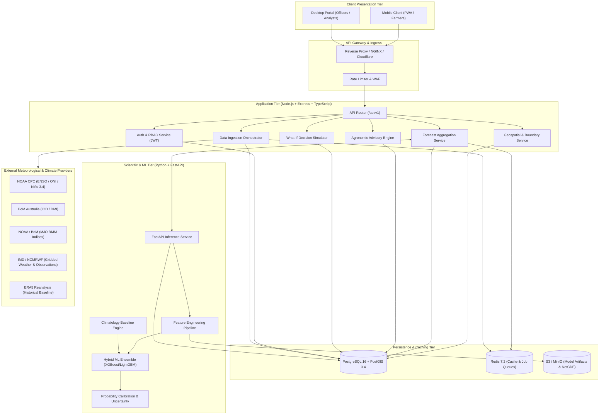
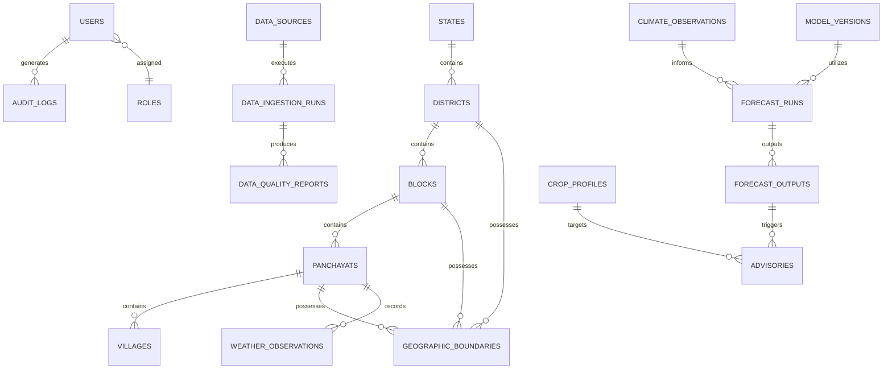
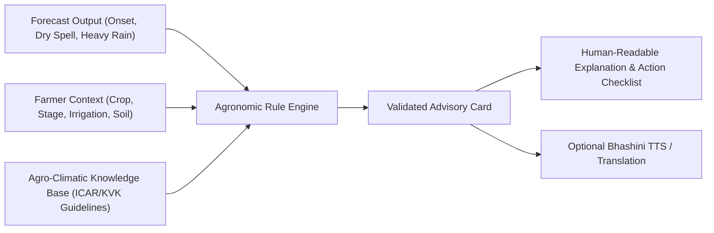
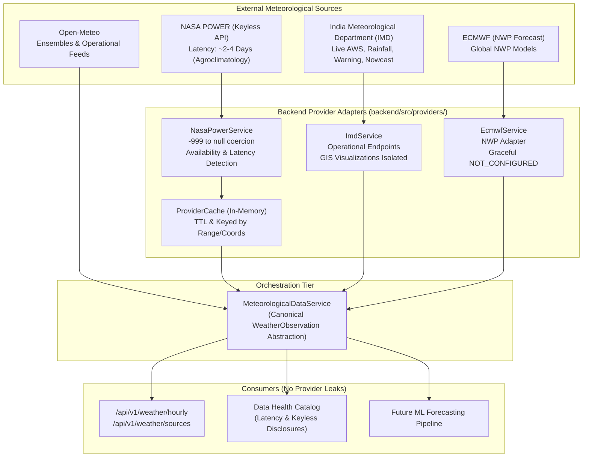

# Technical Architecture Specification
## VarshaSetu (वर्षासेतु)
*“From climate signals to confident farm decisions.”*

---

### Document Information
- **Document Version:** 1.0.0
- **Status:** Phase 1A Approved Specification
- **Reference Date:** September 2026

---

## 1. System Architecture

VarshaSetu is built on a decoupled, modular service-oriented architecture designed to handle large-scale spatial queries, probabilistic meteorological computation, and low-latency client rendering.



### Architectural Principles
1. **Clean Separation of Concerns:** ML and numerical weather computing reside solely in Python microservices. Express handles orchestration, API exposure, authorization, and business rules. React handles UI and visualization.
2. **Provider-Agnostic Abstraction:** External data providers are accessed via standardized adapter interfaces; no single provider's data model leaks into core domain logic.
3. **Strict Data Mode Partitioning:** All pipeline components enforce explicit tagging of `dataMode` (`REAL` vs `DEMO`) from database to UI.
4. **Zero Hardcoded Locations:** The reference demo location (Lucknow District, UP) is injected via configuration (`DEFAULT_DEMO_LOCATION`), never hardcoded in conditional statements.

---

## 2. Frontend Architecture
- **Framework:** React 18+ with TypeScript (Strict Mode).
- **Build Tool:** Vite (ESBuild for rapid HMR and optimized production bundling).
- **Styling:** Tailwind CSS with a customized scientific/editorial design palette.
- **Routing:** React Router v6 with code-splitting via `React.lazy` and `Suspense`.
- **State Management:**
  - Server State: `@tanstack/react-query` (automatic background re-fetching, query caching, and optimistic mutations).
  - UI / Session State: Lightweight Zustand store for user session, active geography selection, and language state.
- **Icons:** `lucide-react` (accessible, consistent iconography).
- **Localization:** `react-i18next` with namespace-based translation files.
- **Design Tokens:**
  - Background Canvas: `#FAF7F2` (Warm Ivory / Off-White).
  - Typography Base: `#0F172A` (Slate 900 Graphite).
  - Primary Affirmative: `#0D9488` (Teal 600).
  - Caution / Dry Spell: `#B45309` (Amber 700).
  - Heavy Rainfall: `#1E40AF` (Blue 800).
  - Severe Risk / Excess: `#DC2626` (Red 600).
  - Typography: `Lexend` (display/headings, chosen for enhanced reading comprehension among emerging readers) + `Inter` (data density and tabular clarity).

---

## 3. Backend Architecture
- **Runtime:** Node.js 20 LTS.
- **Framework:** Express.js with TypeScript.
- **Layered Architecture:**
  - `controllers/`: HTTP route handlers; validates input params and dispatches to domain services.
  - `services/`: Core domain business logic, agronomic rule validation, and inter-service communication.
  - `repositories/`: Database abstraction layer utilizing typed SQL/Kysely/Prisma queries with PostGIS spatial function bindings.
  - `middleware/`: Authentication (JWT), RBAC authorization, request validation (`zod`), rate-limiting, and error handling.
  - `jobs/`: BullMQ background queue processors for scheduled ingestion, data quality checks, and forecast batch caching.
- **Standardized API Response Envelopes:**
  - Success: `{ "success": true, "data": ..., "meta": ... }`
  - Error: `{ "success": false, "error": { "code": ..., "message": ..., "details": ... } }`

---

## 4. Database Architecture
PostgreSQL 16 serves as the primary relational persistence layer.

### Core Entity-Relationship Overview



### Table Definitions & Primary Columns

1. **`users`**
   - `id`: UUID (PK)
   - `phone_number`: VARCHAR(15), UNIQUE, indexed
   - `email`: VARCHAR(255), UNIQUE, nullable
   - `full_name`: VARCHAR(255)
   - `role`: VARCHAR(50) (FARMER, OFFICER, GOVERNMENT, ANALYST, ADMIN)
   - `preferred_language`: VARCHAR(10) DEFAULT 'hi'
   - `assigned_location_id`: UUID (FK to administrative node), nullable
   - `is_active`: BOOLEAN DEFAULT true
   - `created_at`, `updated_at`: TIMESTAMPTZ

2. **`administrative_nodes` (`states`, `districts`, `blocks`, `panchayats`, `villages`)**
   - Hierarchical tables storing official LGD (Local Government Directory) codes, names, centroid coordinates (`latitude`, `longitude`), and foreign keys linking child to parent.

3. **`geographic_boundaries`**
   - `id`: UUID (PK)
   - `entity_type`: VARCHAR(20) ('STATE', 'DISTRICT', 'BLOCK', 'PANCHAYAT')
   - `entity_id`: UUID (FK)
   - `geometry`: `GEOMETRY(MultiPolygon, 4326)` (PostGIS spatial geometry)
   - `area_sq_km`: NUMERIC(10, 2)
   - `is_demo`: BOOLEAN DEFAULT false

4. **`data_sources`**
   - `id`: UUID (PK)
   - `code`: VARCHAR(50) (e.g., 'NOAA_CPC_ENSO', 'IMD_GRIDDED', 'ERA5_REANALYSIS')
   - `name`: VARCHAR(255)
   - `update_frequency_hours`: INT
   - `is_active`: BOOLEAN

5. **`data_ingestion_runs`**
   - `id`: UUID (PK)
   - `source_id`: UUID (FK)
   - `started_at`, `completed_at`: TIMESTAMPTZ
   - `status`: VARCHAR(20) ('RUNNING', 'SUCCESS', 'PARTIAL', 'FAILED')
   - `records_processed`, `records_accepted`, `records_rejected`: INT
   - `error_summary`: JSONB

6. **`climate_observations`**
   - `id`: UUID (PK)
   - `observation_date`: DATE (Indexed)
   - `nino34_index`: NUMERIC(5, 3)
   - `oni_index`: NUMERIC(5, 3)
   - `enso_phase`: VARCHAR(20)
   - `iod_dmi_index`: NUMERIC(5, 3)
   - `iod_phase`: VARCHAR(20)
   - `mjo_phase`: INT
   - `mjo_amplitude`: NUMERIC(5, 3)
   - `is_simulated`: BOOLEAN DEFAULT false

7. **`forecast_runs` & `forecast_outputs`**
   - `run_id`: UUID (PK)
   - `model_version`: VARCHAR(50)
   - `issue_timestamp`, `valid_from`, `valid_until`: TIMESTAMPTZ
   - `target`: VARCHAR(50) (MONSOON_ONSET, DRY_SPELL_BREAK, HEAVY_RAIN, RAINFALL_ANOMALY)
   - `horizon_days`: INT (7, 14, 21, 30)
   - `probability`: NUMERIC(4, 3) (Strictly 0.000 to 1.000)
   - `confidence`: NUMERIC(4, 3)
   - `uncertainty_margin`: NUMERIC(4, 3)
   - `data_mode`: VARCHAR(10) ('REAL', 'DEMO')

8. **`crop_profiles` & `advisories`**
   - `crop_code`: VARCHAR(50) (PADDY, MAIZE, SOYBEAN, PULSES, COTTON, GROUNDNUT, MILLETS)
   - `stage`: VARCHAR(50)
   - `rules_applied`: JSONB
   - `headline`, `recommendations`, `risk_warnings`: JSONB

---

## 5. PostGIS Architecture
- **Coordinate Reference System:** EPSG:4326 (WGS 84 geographic latitude/longitude).
- **Spatial Indexing:** GiST (Generalized Search Tree) indexes on all geometry columns:
  ```sql
  CREATE INDEX idx_boundaries_geom ON geographic_boundaries USING GIST(geometry);
  ```
- **Spatial Operations:**
  1. *Point-in-Polygon Resolution:*
     ```sql
     SELECT entity_id, entity_type FROM geographic_boundaries
     WHERE ST_Contains(geometry, ST_SetSRID(ST_Point(:longitude, :latitude), 4326))
     LIMIT 1;
     ```
  2. *Regional Aggregations:*
     Fast intersection queries for computing district-level risk averages across constituent panchayat centroids.
  3. *MVT Vector Tiles:*
     Direct generation of protobuf tiles via `ST_AsMVT` and `ST_AsMVTGeom` for responsive choropleth rendering on MapLibre / Leaflet.

---

## 6. Data Ingestion Architecture
The data ingestion engine runs as an automated, idempotent pipeline:

```
[EXTERNAL SOURCE] 
       ↓ (HTTP / FTP / S3 Sync)
[FETCH WORKER]
       ↓ (Raw NetCDF / GRIB2 / CSV / JSON)
[SCHEMA VALIDATOR & SANITIZER]
       ↓
[QUALITY CHECKS: Range, Outliers, Timestamp Gaps]
       ↓
[NORMALIZER & SPATIAL INTERPOLATION]
       ↓
[PERSISTENCE: raw_observations / climate_observations]
       ↓
[EVENT: Trigger Feature Store Update]
```

### Ingestion Run Metrics
Every run creates an immutable record tracking:
- `runId`, `sourceId`, `startedAt`, `completedAt`
- `status`: `RUNNING` | `SUCCESS` | `PARTIAL` | `FAILED`
- `recordsProcessed`, `recordsAccepted`, `recordsRejected`
- `dataTimestamp`, `warnings`, `errors`

---

## 7. Forecast Architecture
Forecast generation operates on a decoupled scheduled batch cycle with on-demand fallback:
1. **Daily Cycle (00:00 UTC / 05:30 IST):**
   - Collect latest climate indices (ENSO, IOD, MJO) and NWP gridded outputs.
   - Run spatial downscaling model across target blocks and panchayats.
   - Generate probabilistic metrics for 7, 14, 21, and 30 days.
   - Calibrate output probabilities via Isotonic Regression.
   - Cache results in Redis with a 24-hour TTL and persist in `forecast_outputs`.
2. **Probability Invariant:**
   - Probabilities are strictly maintained in the range `[0.0, 1.0]`.
   - Percentage conversion (`* 100`) occurs solely at the UI presentation boundary.

---

## 8. ML Service Architecture (Python + FastAPI)
- **Framework:** FastAPI with Uvicorn worker processes.
- **Scientific Libraries:** NumPy, pandas, xarray, scikit-learn, XGBoost, LightGBM.
- **Service Endpoints:**
  - `POST /ml/v1/predict/onset`: Forecasts onset window probability and false onset risk score.
  - `POST /ml/v1/predict/dry-spell`: Computes break monsoon probability and revival date.
  - `POST /ml/v1/predict/anomaly`: Projects cumulative rainfall anomaly category and departures.
  - `POST /ml/v1/hindcast/benchmark`: Evaluates model predictions against historical ground truth.
- **Model Storage:** Versioned model binary artifacts (`.joblib` / `.ubj`) tagged with Git commit SHA and training data cutoff timestamp.

---

## 9. Feature Engineering Architecture
The feature engineering pipeline builds a standardized feature vector per geographic unit:
1. **Global Climate Teleconnections:**
   - 3-month running mean Niño 3.4 SST anomaly.
   - Dipole Mode Index (DMI) and rate of change over past 15 days.
   - MJO Wheeler-Hendon RMM1/RMM2 phase coordinates.
2. **Regional Atmospheric Precondition Indicators:**
   - Zonal winds at 850 hPa (low-level westerly surge strength).
   - Meridional winds at 200 hPa (upper-level easterly jet position).
   - Precipitable water depth (Total Column Water Vapor) over the regional quadrant.
3. **Climatological Baselines:**
   - 30-year daily mean rainfall and standard deviation for the given calendar day of year (DOY).
   - Consecutive dry days in preceding 14-day window.

---

## 10. Advisory Architecture
The Advisory Engine translates raw meteorological probabilities into practical agronomic counsel without relying on generative LLMs for recommendation logic.



### Deterministic Rule Enforcement
- Recommendations are triggered by explicit condition matrices (e.g., `IF crop == 'PADDY' AND stage == 'NURSERY_SOWING' AND false_onset_risk > 0.35 THEN action = 'HOLD_NURSERY_SOWING'`).
- Every advisory record retains the `ruleId` and rationale for scientific auditability.

---

## 11. API Architecture
All APIs adhere to strict versioning: `/api/v1/...`

### Core Route Blueprint
- **`/api/v1/auth`**
  - `POST /login`: Authenticate phone/credentials, returns JWT.
  - `POST /refresh`: Refresh session token.
  - `GET /me`: Return current user profile and RBAC permissions.
- **`/api/v1/geography`**
  - `GET /states`: List supported states.
  - `GET /districts?stateId=...`: List districts.
  - `GET /blocks?districtId=...`: List blocks.
  - `GET /panchayats?blockId=...`: List panchayats.
  - `GET /resolve-point?lat=...&lon=...`: Point-in-polygon resolution.
- **`/api/v1/climate`**
  - `GET /signals/latest`: Returns current ENSO, IOD, MJO state.
  - `GET /signals/history`: Historical teleconnection timeseries.
- **`/api/v1/forecasts`**
  - `GET /hyperlocal?locationId=...&horizons=7,14,21,30`: Primary probabilistic outlook.
  - `GET /provenance/:forecastId`: Full data lineage and model version details.
- **`/api/v1/maps`**
  - `GET /tiles/:z/:x/:y.pbf`: Dynamic vector tiles with risk metrics.
  - `GET /geojson/risk-overlay?target=DRY_SPELL&horizon=14`: GeoJSON feature collection.
- **`/api/v1/advisories`**
  - `POST /evaluate`: Evaluates rules for given location and crop context.
  - `GET /crops`: List supported crops and allowable growth stages.
- **`/api/v1/simulations`**
  - `POST /what-if`: Executes comparative what-if scenario assessment.
- **`/api/v1/officers`**
  - `GET /district-summary/:districtId`: High-level multi-block risk aggregate.
  - `POST /bulletin`: Disseminate broadcast advisory to registered panchayats.
- **`/api/v1/models`**
  - `GET /registry`: Model versions, Brier scores, and validation reports.
- **`/api/v1/data-health`**
  - `GET /status`: Pipeline ingestion runs, freshness indicators, and data quality metrics.

---

## 12. Authentication
- **Token Mechanism:** Stateless JSON Web Tokens (JWT) signed using HMAC-SHA256 (`HS256`) or RSA (`RS256`).
- **Token Lifetime:** 15-minute access token; 7-day secure HTTP-only refresh token stored with cryptographic hash in Redis.
- **Passwordless Farmer Flow (Future Ready):** OTP-based mobile authentication via SMS gateway; fallback to secure PIN.

---

## 13. Role-Based Access Control (RBAC)

| Domain Route Group | FARMER | OFFICER | GOVERNMENT | ANALYST | ADMIN |
| :--- | :---: | :---: | :---: | :---: | :---: |
| `/api/v1/auth/me` | Read | Read | Read | Read | Read |
| `/api/v1/geography/*` | Read | Read | Read | Read | Read/Write |
| `/api/v1/forecasts/*` | Read (Local) | Read (Jurisdiction) | Read (State/All) | Read (All) | Read (All) |
| `/api/v1/advisories/evaluate` | Read/Execute | Read/Execute | Read | Read | Read |
| `/api/v1/simulations/what-if` | Read/Execute | Read/Execute | Read | Read | Read |
| `/api/v1/officers/bulletin` | No Access | Create/Broadcast | Read | Read | Manage |
| `/api/v1/maps/tiles` | Read | Read | Read | Read | Read |
| `/api/v1/models/*` | No Access | No Access | Read Reports | Read/Evaluate | Manage |
| `/api/v1/data-health/*` | No Access | View Summary | View Summary | Read Detailed | Full Manage |
| `/api/v1/admin/*` | No Access | No Access | No Access | No Access | Full Manage |

---

## 14. Caching Strategy
- **Layer 1 (Memory / Node Cache):** LRU cache for static geographic hierarchy (States, Districts, Blocks) with 24-hour TTL.
- **Layer 2 (Distributed Redis):**
  - Key `forecast:{locationId}:{horizon}`: 6-hour TTL, invalidated upon new pipeline run.
  - Key `climate:signals:latest`: 3-hour TTL.
  - Key `mvt:tile:{z}:{x}:{y}`: 1-hour TTL for vector map tiles.

---

## 15. Background Jobs & Worker Architecture
- **Queue Manager:** BullMQ backed by Redis.
- **Scheduled Queues:**
  1. `nightly-ingestion-queue`: Triggered every 6 hours to fetch updated global and regional indicators.
  2. `forecast-generation-queue`: Triggered post-ingestion to run Python downscaling models for all active panchayats.
  3. `data-quality-auditor`: Periodic heartbeat validating pipeline freshness and generating health reports.

---

## 16. Multilingual Architecture
- **Client Localization:** `react-i18next` utilizing hierarchical JSON structures (`locales/en/` and `locales/hi/`).
- **Dynamic Content Translation:** Domain terms (crop names, growth stages, weather parameters) are referenced via standardized localization keys (e.g., `crops.paddy.name`, `stages.nursery.desc`).
- **Future Bhashini Orchestration:** Backend translation proxy contract prepared to route dynamic advisory text through Bhashini NMT (Neural Machine Translation) with caching of previously translated advisory snippets in Redis.

---

## 17. Voice Architecture
- **Design Philosophy:** Voice serves as an alternate input and output modality for core forecast and advisory questions, not an open-ended conversational bot.
- **Inbound Voice:** Speech-to-Text (STT) converts audio into text -> Intent Extractor maps input to predefined domain intents (`CHECK_ONSET`, `GET_ADVISORY`, `RUN_SIMULATION`) -> Passes structured params to backend API.
- **Outbound Voice:** High-priority cards (Forecast Summary, Action Items) provide a "Listen" button triggering Text-to-Speech (TTS) audio playback.

---

## 18. Security Architecture
- **OWASP Top 10 Compliance:**
  - Input validation using `zod` on all request bodies and query parameters.
  - Parameterized queries to eliminate SQL/spatial injection.
  - Helmet.js for secure HTTP headers (CSP, HSTS, X-Frame-Options).
  - Rate limiting via `express-rate-limit` + Redis sliding window.
- **Secret Management:** Strictly zero credentials stored in repository; all access configured via `.env` with validation during application bootstrap.

---

## 19. Monitoring & Observability
- **Metrics:** Prometheus metrics endpoint exposing HTTP request duration, DB query latency, ML inference duration, and cache hit rates.
- **Logging:** Structured JSON logs via Winston or Pino containing `timestamp`, `level`, `requestId`, `userId`, `action`, and `durationMs`.
- **Error Tracking:** Centralized error boundary in React; unhandled rejection handlers in Node.js and FastAPI.

---

## 20. Deployment Architecture
- **Containerization:** Docker multi-stage builds for Frontend (Nginx alpine), Backend (Node.js alpine), and ML Service (Python slim with compiled wheels).
- **Orchestration:** Docker Compose for local/staging development; Kubernetes (EKS / GKE) manifests for production scaling.
- **Database:** Managed Cloud PostgreSQL with PostGIS extension (e.g., AWS RDS for PostgreSQL or Supabase/Neon).

---

## 21. Scalability Architecture
- **Horizontal API Scaling:** Stateless Express nodes scale dynamically behind ALB / Ingress.
- **PostGIS Read Replicas:** Read-only replicas serve heavy spatial map vector queries and officer aggregation reports.
- **Spatial Partitioning:** Geographic boundaries and observation tables partitioned by state/region code for massive query pruning.

---

## 22. Repository Structure
```
VarshaSetu/
├── .env.example                # Canonical environment variable configuration template
├── .gitignore                  # Git exclusions for Node, Python, build artifacts
├── README.md                   # Developer onboarding & architectural overview
├── docs/                       # Project documentation
│   ├── PRD.md                  # Product Requirements Document (28 sections)
│   ├── architecture.md         # Comprehensive Technical Architecture (23 sections)
│   └── progress.md             # Continuous Phase Progress Tracker
├── shared/                     # Universal shared contracts, models & types
│   └── types/
│       ├── core.ts             # API envelopes, DataMode, statuses, pagination
│       ├── geography.ts        # Hierarchy: State->District->Block->Panchayat, PostGIS types
│       ├── climate.ts          # ENSO, IOD, MJO signals, regional weather
│       ├── forecast.ts         # Probabilistic outlooks, targets, horizons
│       ├── advisory.ts         # Crops, growth stages, rules, what-if simulations
│       ├── auth.ts             # RBAC roles, permission scopes, user entities
│       └── index.ts            # Unified barrel export
├── frontend/                   # React + TypeScript + Vite UI Application (Phase 1B+)
├── backend/                    # Node.js + Express + TypeScript API Service (Phase 2+)
├── ml-service/                 # Python + FastAPI Scientific & ML Engine (Phase 4+)
├── tests/                      # System integration & cross-service contract tests
└── scripts/                    # Database seeding, ingestion triggers, dev utilities
```

---

## 23. Architectural Decisions (ADR Summary)
- **ADR-001: Separation of ML and Application Tiers.** Python was chosen for scientific modeling (xarray, scikit-learn, XGBoost) while Node.js/TypeScript was selected for the primary API, leveraging its asynchronous I/O and shared TypeScript typing with the React frontend.
- **ADR-002: Probabilistic Standards.** All forecast likelihoods are stored normalized between `0.0` and `1.0`. Deterministic weather predictions for 14–30 day periods are scientifically invalid and strictly forbidden.
- **ADR-003: PostGIS for Administrative Geometries.** Storing vector boundaries directly in PostGIS allows sub-second point-in-polygon resolution and server-side vector tile clipping, eliminating heavy spatial calculation in client code.
- **ADR-004: Decoupled Advisory Logic.** Agronomic recommendations are derived from explicit, deterministic rules evaluated against forecasts rather than black-box LLM prompts, ensuring transparent, explainable advice.
- **ADR-005: Configurable Demo Location.** Lucknow District, UP is designated as the reference initial demonstration location via configuration (`DEFAULT_DEMO_LOCATION`), prohibiting any hardcoded location-specific logic.
- **ADR-006: Normalized Meteorological Provider Layer.** External meteorological data sources (NASA POWER, IMD, ECMWF) are decoupled through canonical abstractions (`WeatherObservation`, `MeteorologicalDataService`). Secrets reside strictly in `backend/.env`. NASA POWER is modeled as a keyless historical/agroclimatology reanalysis source with ~2-4 day latency (never misrepresented as live weather), and -999 values are strictly coerced to null.

---

## 24. External Meteorological Provider Architecture



