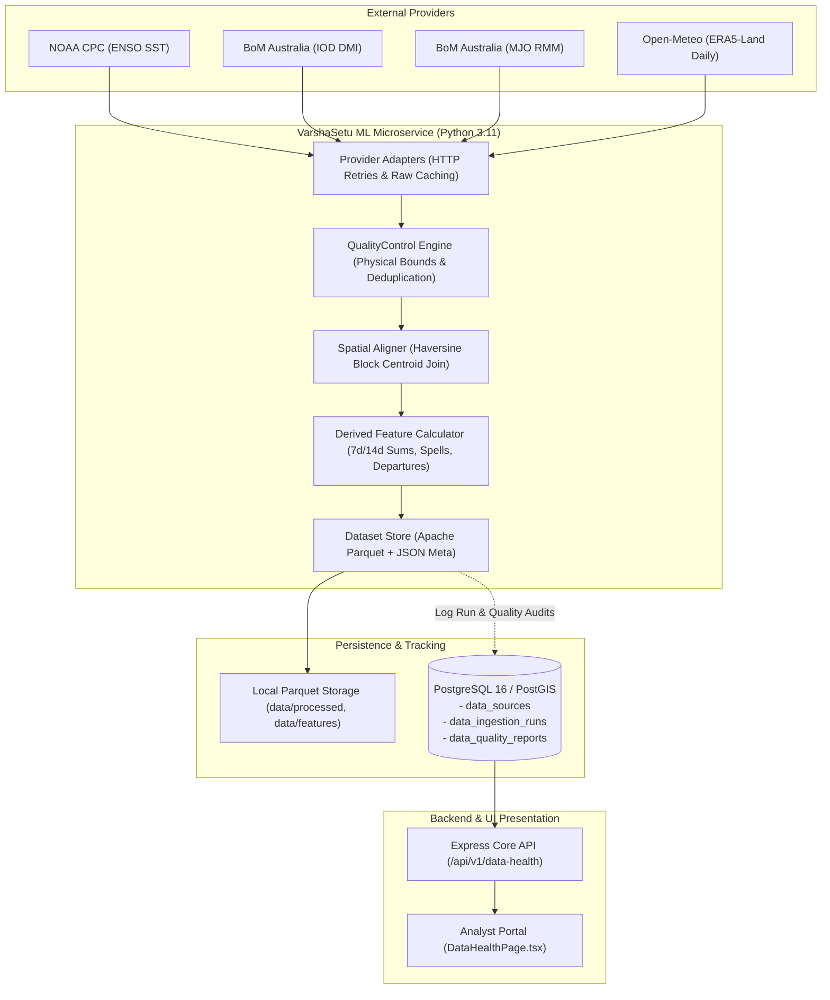

# VarshaSetu Scientific Data Pipeline
**Phase 3 Architecture & Operational Guide**

---

## 1. Architectural Overview

The VarshaSetu scientific data pipeline executes within the Python microservice (`ml-service/`), orchestrated to safely ingest, validate, standardize, and transform atmospheric and oceanic datasets into high-performance Apache Parquet storage. Execution health and data quality audits are atomically logged to PostgreSQL.

---

## 2. Ingestion Pipeline Stages

### Stage 1: Extraction & Network Resilience
- **Retry Mechanism:** All HTTP requests execute via an asynchronous `httpx.AsyncClient` with bounded exponential backoff ($2^k \times 1.0\text{s}$) up to 3 retries.
- **Raw Payload Preservation:** Raw server responses (ASCII tables, CSV, JSON) are archived to `ml-service/data/raw/` prior to parsing for reproducibility.
- **Offline / Test Resiliency:** If external upstream endpoints are unreachable, standard historical fallback baselines ensure the pipeline fails gracefully without system crashes.

### Stage 2: Ingestion & Normalization
- Converts irregular provider formats (fixed-width tables, whitespace-separated text, variable header rows) into standardized pandas DataFrames.
- Strict physical units normalization:
  - Precipitation $\to \text{mm/day}$
  - Temperature $\to ^\circ\text{C}$
  - Atmospheric pressure $\to \text{hPa}$
  - Wind speed $\to \text{m/s}$
  - Date strings $\to \text{ISO 8601 YYYY-MM-DD}$

### Stage 3: Scientific Quality Control (QC)
- Executed by `QualityController.audit_dataframe()`.
- Validates physical minimum and maximum boundaries for each variable.
- Checks chronological continuity and eliminates duplicate timestamps.
- Flags each record with `GOOD`, `WARNING`, `BAD`, or `MISSING`.
- Computes aggregate `quality_score` ($1.0 - \frac{\text{missing} + \text{outliers}}{\text{total}}$).

### Stage 4: Spatial Alignment (Haversine Administrative Join)
- Executed by `AdministrativeSpatialAligner.align_weather_to_blocks()`.
- Calculates great-circle Haversine distance between weather observation coordinates and Lucknow district block centroids (Bakshi Ka Talab, Malihabad, Mohanlalganj, Sarojininagar, Gosainganj, Chinhat).
- Tags each weather observation with official administrative codes (`UP_LKO_BKT`, `UP_LKO_MAL`, etc.).

### Stage 5: Agrometeorological Feature Derivation
- Rolling 7-day and 14-day cumulative rainfall.
- Binary dry day classification ($< 1.0\text{ mm}$).
- IMD-standard heavy rainfall event classification ($\ge 64.5\text{ mm}$).
- Cumulative consecutive dry days ($CDD$) and wet days ($CWD$).
- Climatological normal departures ($\Delta P\%$).

### Stage 6: Atomic Storage & PostgreSQL Logging
- Parquet storage via `pyarrow` using SNAPPY compression for lightning-fast ML retrieval.
- Provenance metadata written to adjacent `*_meta.json` sidecar.
- Run status, record counts, and quality metrics recorded to `data_ingestion_runs` and `data_quality_reports` in PostgreSQL.
- Associated `data_sources` row updated to `FRESH` with current timestamp.

---

## 3. Microservice Endpoints (`ml-service`)

The Python FastAPI microservice runs on port 8000:

| Method | Endpoint | Description |
| :--- | :--- | :--- |
| `GET` | `/health` | Microservice liveness and storage directory readiness |
| `GET` | `/data/status` | Current data catalog status, row counts, and metadata |
| `GET` | `/data/catalog` | Detailed metadata for all processed Parquet datasets |
| `GET` | `/data/features` | Preview of Lucknow derived agromet features matrix |
| `POST` | `/ingestion/run` | Trigger on-demand ingestion run across climate or weather feeds |

---

## 4. Backend Health Endpoints (`backend`)

The Node.js/TypeScript backend proxies and queries telemetry for frontend consumption:

| Method | Endpoint | Description |
| :--- | :--- | :--- |
| `GET` | `/api/v1/data-health` | High-level overview: total sources, fresh sources, run counts, overall pipeline health |
| `GET` | `/api/v1/data-health/sources` | Complete list of registered data sources with freshness indicators |
| `GET` | `/api/v1/data-health/runs` | Paginated ingestion run history with quality summaries |
| `GET` | `/api/v1/data-health/runs/:id` | Detailed run metadata including comprehensive data quality reports |
| `POST` | `/api/v1/data-health/trigger` | Triggers the ML service ingestion pipeline on demand |
