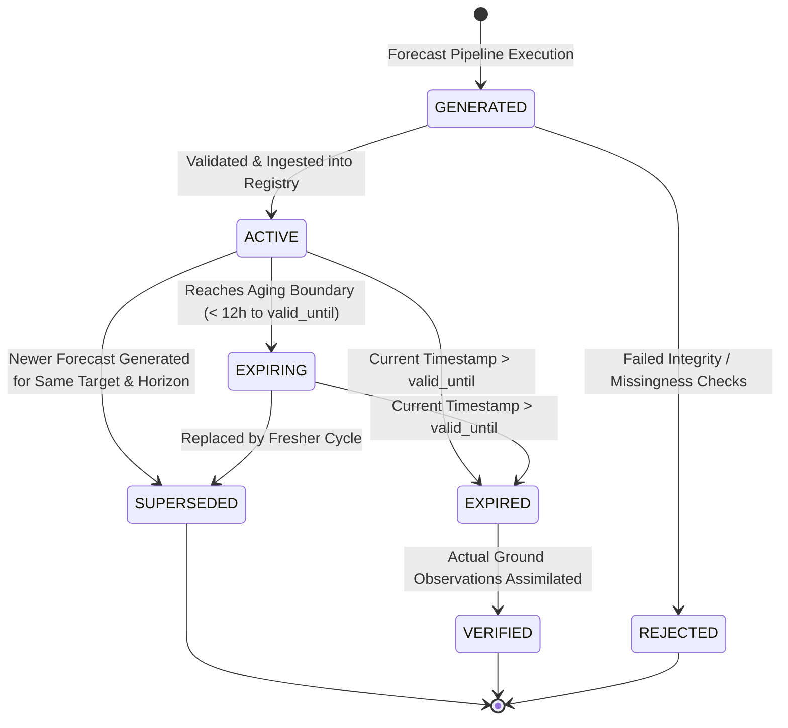

# Phase 4F: Forecast Lifecycle State Machine & Expiry Architecture

## 1. Lifecycle Overview

Operational weather intelligence systems require strict temporal governance over generated forecasts. Forecast products are non-static: they undergo validity aging, potential supersession when fresh model runs emerge, verification when ground truth observations materialize, and deterministic expiration when validity windows elapse.

VarshaSetu formalizes this governance through an explicit, deterministic finite state machine (FSM) implemented in both the ML service (`ml-service/app/lifecycle/`) and PostgreSQL (`backend/src/db/migrations/008_forecast_events_lifecycle.sql`).

---

## 2. State Machine Specification

### State Definitions

| State | Semantic Meaning | Query Visibility |
| :--- | :--- | :--- |
| `GENERATED` | Raw prediction produced by model; pending integrity and metadata verification | Internal only |
| `ACTIVE` | Verified, calibrated forecast within its primary validity period | Default user & officer view |
| `EXPIRING` | Forecast within 12 hours of its `valid_until` deadline | Visible with aging tag |
| `EXPIRED` | Forecast past its validity window; superseded by temporal passage | Archive & verification view |
| `VERIFIED` | Expired forecast matched against observed ground truth rainfall; errors computed | Hindcast and audit reports |
| `SUPERSEDED` | Forecast replaced by a newer generation cycle before expiry | Historical lineage only |
| `REJECTED` | Forecast failed QC checks (excessive missingness, out-of-bounds probability) | Audit quarantine |

---

## 3. Allowed Transition Matrix & Guard Rules

Transitions between states are deterministic and strictly validated. Illegal transitions (e.g. attempting to activate an already `EXPIRED` forecast or re-verify a `GENERATED` forecast) throw explicit `IllegalStateTransitionError` exceptions.

| From State | Allowed Target States | Triggering Event |
| :--- | :--- | :--- |
| `GENERATED` | `ACTIVE`, `REJECTED` | Automated ingestion check |
| `ACTIVE` | `EXPIRING`, `EXPIRED`, `SUPERSEDED` | Expiry sweep, timeline aging, new generation run |
| `EXPIRING` | `EXPIRED`, `SUPERSEDED` | Expiry sweep, newer generation run |
| `EXPIRED` | `VERIFIED` | Ground truth assimilation run |
| `SUPERSEDED` | (None — terminal state) | Archive preservation |
| `VERIFIED` | (None — terminal state) | Audit record complete |
| `REJECTED` | (None — terminal state) | Quarantined |

---

## 4. Freshness Classification Matrix

Forecasts and underlying observation data are evaluated against temporal freshness rules:

| Freshness Level | Observation Lag ($\Delta t_{obs}$) | Forecast Validity Window ($\Delta t_{val}$) | Operational Treatment |
| :--- | :--- | :--- | :--- |
| **`FRESH`** | $< 24$ hours | $t \le \text{valid\_until} - 24\text{h}$ | Permitted for real-time guidance |
| **`AGING`** | $24$ to $48$ hours | $\text{valid\_until} - 24\text{h} < t \le \text{valid\_until}$ | Tagged with freshness advisory |
| **`STALE`** | $> 48$ hours | $t > \text{valid\_until}$ | Model gating triggered; operational certification withheld |
| **`EXPIRED`** | N/A | $t > \text{valid\_until}$ | Automated state transition to `EXPIRED` |
| **`HISTORICAL`** | Single-season historical archive | Kharif 2024 archive window | Strictly locked to `DIAGNOSTIC_ONLY` |

---

## 5. Expiry Sweep Execution

The platform provides an idempotent automated expiry sweep processor:
- **ML Service:** `POST /api/v1/forecasts/process-expiry`
- **Backend API:** `POST /api/v1/forecasts/process-expiry` (RBAC: `analyst`, `admin`)
- **Execution Logic:**
  1. Identifies all forecasts in `ACTIVE` or `EXPIRING` state.
  2. Compares `valid_until` against current UTC time.
  3. Transitions expired records to `EXPIRED` and logs transition records with reason `"Automated validity window expiration"`.
  4. Automatically sweeps associated event records in `DETECTED`, `ACKNOWLEDGED`, or `UPDATED` whose validity windows have elapsed to `EXPIRED`.
  5. Returns processed counts, expired forecast counts, and duration metadata.
