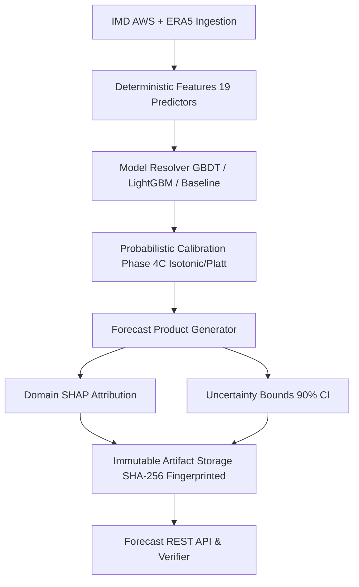

# Phase 4E: Operational Forecast Products, API & Scientific Explainability

## 1. Overview & Operational Purpose

VarshaSetu's Phase 4E operational forecast product layer bridges statistical downscaling models (Phase 4B), probabilistic calibration (Phase 4C), and multi-year hindcast evaluation (Phase 4D) into a unified, contract-enforced, and reproducible operational forecast engine.

The system synthesizes meteorological inputs, engineered features, model predictions, calibration maps, uncertainty bounds, and domain-grouped SHAP explanations into immutable forecast artifacts. Every forecast product generated by the platform adheres strictly to scientific disclosure standards, explicitly distinguishing diagnostic predictions from operational meteorological guidance.

---

## 2. Scientific Architecture & Data Reality

### Strict Ground Truth Realism
As established across Phases 3 through 4D:
- Ground truth meteorological observations currently assimilate **Bakshi Ka Talab (`UP_LKO_BKT`)** in Lucknow district, Uttar Pradesh.
- The temporal window spans **122 daily records** across Kharif 2024 (June 1, 2024 to September 30, 2024).
- Surrounding blocks (`UP_LKO_MLH`, `UP_LKO_MHL`, `UP_LKO_SRJ`, `UP_LKO_GSN`, `UP_LKO_CHN`) serve as spatial interpolation anchors and are tagged `PENDING_ASSIMILATION`.
- State-wide coverage across Uttar Pradesh currently reflects 1 block assimilated out of 820+ administrative blocks.

### Diagnostic Gate Enforcement
Because empirical observations do not yet span multiple distinct monsoon seasons, the system's operational safety gate unconditionally marks all forecasts as `DIAGNOSTIC_ONLY` and data freshness as `HISTORICAL_ONLY`. No live operational guidance is distributed.



---

## 3. Forecast Record Schema & Contract (`ScientificForecastRecord`)

Every forecast generated or served by VarshaSetu implements the strict, immutable contract defined in `ml-service/app/schemas/forecast.py` and `shared/types/forecast.ts`:

| Context Block | Schema Structure | Description |
| :--- | :--- | :--- |
| **Header** | `forecast_id`, `generated_at`, `valid_from`, `valid_until` | Unique identifier, timestamp, and ISO 8601 validation window |
| **`location`** | `state_id`, `district_id`, `block_id`, `latitude`, `longitude`, `spatial_resolution` | Administrative spatial hierarchy and resolution bounds |
| **`target`** | `target_type`, `target_definition_version`, `threshold`, `unit` | Target definition, meteorological thresholds (e.g. 64.5mm), and unit |
| **`horizon`** | `horizon_days`, `horizon_label` | Forecast lead time (1, 3, 7, 14, 21, 30 days) and semantic label |
| **`model`** | `model_id`, `model_family`, `model_version`, `training_period`, `dataset_fingerprint` | Model architecture, version, training temporal bounds, SHA-256 fingerprint |
| **`prediction`** | `probability`, `predicted_value`, `category`, `event_observed_reference` | Calibrated probability, point estimation, category (LOW/MODERATE/HIGH/SEVERE) |
| **`calibration`** | `status`, `calibrator_type`, `calibration_artifact_id` | Status (`CALIBRATED` / `NOT_CALIBRATED`), method (`ISOTONIC` / `PLATT_SIGMOID`) |
| **`uncertainty`** | `status`, `lower_bound`, `median`, `upper_bound`, `method` | 90% confidence interval, parametric or non-parametric bootstrap bounds |
| **`validation`** | `validation_status`, `validation_years`, `hindcast_experiment_id` | Multi-year hindcasting audit status and lineage link |
| **`explainability`** | `status`, `top_features`, `shap_artifact_id` | Domain-grouped SHAP feature contributions and narrative explanations |
| **`data`** | `source_status`, `freshness_status`, `missingness`, `feature_coverage` | Ingestion status, staleness indicator, missingness rate, feature checklist |
| **`scientific_disclosure`** | `status`, `messages` | `DIAGNOSTIC_ONLY` flag and scientific limitation disclosures |

---

## 4. Model Resolution Architecture & Precedence

The `ForecastModelResolver` (`ml-service/app/forecast/resolver.py`) inspects disk artifacts in `ml-service/artifacts/models/` and selects the model matching user requests or defaults using the following scientific hierarchy:

1. **Pre-trained XGBoost GBDT Downscaler** (`xgb_downscale_heavy_rain_7d.joblib`): Primary non-linear model trained on ERA5 + IMD features.
2. **Pre-trained LightGBM Regressor / Classifier** (`lgb_downscale_heavy_rain_7d.joblib`): Gradient boosting alternative with leaf-wise splitting.
3. **Phase 4A Baseline Models** (`baseline_logistic_regression.joblib`, `baseline_ridge_regression.joblib`): Linear reference models.
4. **Empirical Climatology Baseline** (`baseline_climatology.joblib`): Historical frequency benchmark.

The resolver maintains an in-memory cache of loaded models, validates dataset fingerprints against incoming training records, and gracefully falls back to baseline or synthetic estimators if disk models are absent.

---

## 5. Data Freshness & Ingestion Availability Gate

The `ForecastAvailabilityGate` (`ml-service/app/forecast/availability.py`) evaluates real-time data ingestion readiness against 19 required meteorological predictors:

- **FRESH**: Latest observation within 24 hours of execution.
- **AGING**: Latest observation between 24 and 48 hours old.
- **STALE**: Latest observation between 48 and 72 hours old.
- **HISTORICAL_ONLY**: Data window older than 72 hours (applies unconditionally to the Kharif 2024 dataset).
- **MISSING**: Ingestion source unreachable or observations absent.

Operational forecasts are strictly prohibited (`operational_allowed = False`) when freshness status is `HISTORICAL_ONLY`, `STALE`, or `MISSING`.

---

## 6. Forecast Horizons Registry

The system supports 6 standardized meteorological horizons:

| Horizon | Lead Time | Meteorological Scale | Uncertainty Supported | Primary Agricultural Application |
| :--- | :--- | :--- | :--- | :--- |
| **1-Day** | 24 Hours | Micro / Convective | Yes (Bootstrap) | Extreme event warnings & daily monitoring |
| **3-Day** | 72 Hours | Mesoscale | Yes (Bootstrap) | Short-range moisture assessments |
| **7-Day** | 168 Hours | Synoptic Scale | Yes (Parametric/Bootstrap) | Medium-range weather outlooks |
| **14-Day** | 336 Hours | Sub-Seasonal Synoptic | Yes (Parametric/Climatology) | Extended dry spell risk projections |
| **21-Day** | 504 Hours | Extended Range | Yes (Climatology Bounds) | Intraseasonal oscillation monitoring |
| **30-Day** | 720 Hours | Monthly / Intraseasonal | Yes (Climatology Bounds) | Monthly cumulative rainfall outlooks |

---

## 7. Probabilistic Calibration Integration

Forecast probabilities are calibrated using Phase 4C calibrators (`ml-service/artifacts/calibration/`):
- **Isotonic Regression**: Non-parametric piecewise constant calibration preserving rank order.
- **Platt Sigmoid Scaling**: Parametric logistic sigmoid calibration for sparse sample regions.

Calibrated probabilities are accompanied by calibration verification metadata (Brier Score, Expected Calibration Error, Reliability Gap). If calibration artifacts are unavailable, forecasts are explicitly flagged `NOT_CALIBRATED` with raw model outputs.

---

## 8. Uncertainty Quantification & Interval Representation

For every probabilistic forecast, VarshaSetu calculates a 90% confidence interval `[lower_bound, upper_bound]`:
- **Empirical Uncertainty**: Standard error derived from validation residual spreads.
- **Bootstrap Sampling**: Resampling of tree ensemble outputs across folds.
- **Climatological Spread**: Extended-range horizons (21D, 30D) scale uncertainty bounds with lead time variance.

---

## 9. Domain-Grouped SHAP Attribution & Explainability

Model predictions are accompanied by domain-grouped SHAP attributions generated by `ForecastExplanationGenerator` (`ml-service/app/forecast/disclosure.py`):

1. **Moisture & Convective Profile**: Relative humidity (rh700, rh850), convective available potential energy, total precipitable water.
2. **Synoptic Wind Field**: Zonal wind (u850), meridional wind (v850), wind shear, monsoon trough proximity.
3. **Thermodynamic Instability & Pressure**: Vertical velocity (w700), surface pressure gradient, temperature lapse rate.
4. **Antecedent Precipitation & Soil Moisture**: Cumulative 3-day rainfall, 7-day rainfall anomaly, antecedent wetness index.

### Non-Causal Scientific Disclosure
All explanations strictly enforce non-causal language (e.g., *"Elevated mid-tropospheric relative humidity is statistically associated with higher event probability"* rather than *"High humidity caused this rainfall"*).

---

## 10. Spatial Resolution & Observational Anchor Boundaries

- **Block-Level Aggregation (`BLOCK`, ~9 km)**: The official operational and diagnostic unit of VarshaSetu.
- **Observational Ground Anchor**: Bakshi Ka Talab (`UP_LKO_BKT`) is the sole block possessing calibrated station ground truth.
- **Spatial Prior Extrapolation**: Surrounding blocks are estimated using spatial interpolation priors and explicitly disclosed as `PENDING_ASSIMILATION`.
- **Zero Block Ranking Policy**: In accordance with scientific integrity guidelines, blocks are never ranked as "best" or "worst".

---

## 11. Historical Forecast Storage & Immutable Artifact Management

All generated forecasts are persisted as immutable JSON files in `ml-service/artifacts/forecasts/` using deterministic naming:
```
forecast_{target_type}_{horizon_days}d_{timestamp}_{uuid_fragment}.json
```
Each artifact includes the SHA-256 fingerprint of the input dataset, model version, calibrator version, and full parameter specifications, enabling exact retrospective reproduction.

---

## 12. Retrospective Forecast Verification Framework (`ForecastVerifier`)

The `ForecastVerifier` (`ml-service/app/forecast/verification.py`) provides retrospective accuracy assessment against observed ground truth:
- **Lead Window Matching**: Aligns `valid_from` to `valid_until` against recorded daily rainfall.
- **Contingency Classification**:
  - `HIT`: Forecast $\ge 0.5$ and event observed.
  - `MISS`: Forecast $< 0.5$ and event observed.
  - `FALSE_ALARM`: Forecast $\ge 0.5$ and event not observed.
  - `CORRECT_REJECTION`: Forecast $< 0.5$ and event not observed.
- **Scoring Metrics**:
  - Brier Score: $(p - o)^2$
  - Logarithmic Loss: $-[o \ln(p) + (1-o) \ln(1-p)]$
  - Continuous Error: Absolute error $|y_{pred} - y_{obs}|$ for rainfall amounts.
- **Future Window Protection**: Returns `PENDING` when the forecast validation window has not elapsed.

---

## 13. Multi-Tier Operational Safety Gates (`ForecastOperationalGate`)

A multi-tier gate evaluates whether a forecast product may be distributed for operational decision support:

1. **Model Readiness Gate**: Requires a validated model instance with verified checksums.
2. **Calibration Gate**: Confirms Brier score $\le 0.25$ and calibration pass status.
3. **Multi-Year Validation Gate**: Confirms validation across $\ge 2$ historical monsoon seasons.
4. **Data Freshness Gate**: Requires telemetries received within $\le 48$ hours.
5. **Spatial Resolution Gate**: Confirms block boundaries adhere to administrative GIS standards.

**Current Synthesis**: Because the multi-year gate is `INSUFFICIENT_DATA` and data freshness is `HISTORICAL_ONLY`, the operational status resolves unconditionally to `DIAGNOSTIC_ONLY`.

---

## 14. Scientific Disclosures & Ethical Boundaries

### Strict Separation from Agronomic Action Commands
Forecast products provide purely meteorological risk assessments and quantitative precipitation projections. They strictly contain **zero agronomic imperatives** (e.g., no instructions to "sow", "spray pesticides", "irrigate crops", or "harvest"). Agronomic decision support belongs strictly to subsequent expert advisory systems (Phase 5).

### Mandatory Diagnostic Disclaimer
All API responses and UI dashboards display:
> *"Diagnostic forecast — not operational. Ground observations reflect historical Kharif 2024 archive. Not verified for operational agricultural decisions."*

---

## 15. REST API Specification & Endpoint Catalog

The backend exposes 10 forecast endpoints under `/api/v1/forecasts`:

| Method | Endpoint | Description | Role Access |
| :--- | :--- | :--- | :--- |
| `GET` | `/status` | Operational forecast gate status & service readiness | All authenticated |
| `GET` | `/availability` | Feature coverage, data freshness & staleness report | All authenticated |
| `GET` | `/` | Query forecasts filtered by target, horizon, block, status | All authenticated |
| `GET` | `/:id` | Fetch complete immutable forecast record by ID | All authenticated |
| `GET` | `/:id/explanation` | Fetch SHAP feature attribution & evidence summary | All authenticated |
| `GET` | `/location/:blockId` | Fetch all active forecast products for a block | All authenticated |
| `POST` | `/generate` | Generate on-demand forecast via ML engine | Analyst, Admin |
| `GET` | `/history` | Retrospective forecast log and verification outcomes | Analyst, Officer, Admin |
| `GET` | `/targets` | Registry of supported scientific forecast targets | All authenticated |
| `GET` | `/horizons` | Registry of supported forecast lead times (1–30d) | All authenticated |

---

## 16. Known Operational Limitations & Future Readiness

1. **Single-Season Data Horizon**: Models are trained on Kharif 2024 (122 daily steps). Generalization across anomalous dry or wet years remains unverified until multi-year ground truth is assimilated.
2. **Spatial Anchoring Constraint**: Station ground truth exists solely at Bakshi Ka Talab AWS. Regional gradients rely on ERA5 reanalysis interpolation.
3. **Phase 4F Gate**: Phase 4F will address multi-model ensemble stacking, spatial teleconnection ingestion, and long-range monsoon pacing.
4. **Hard Stop**: Phase 4F and Phase 5 remain strictly unstarted.
