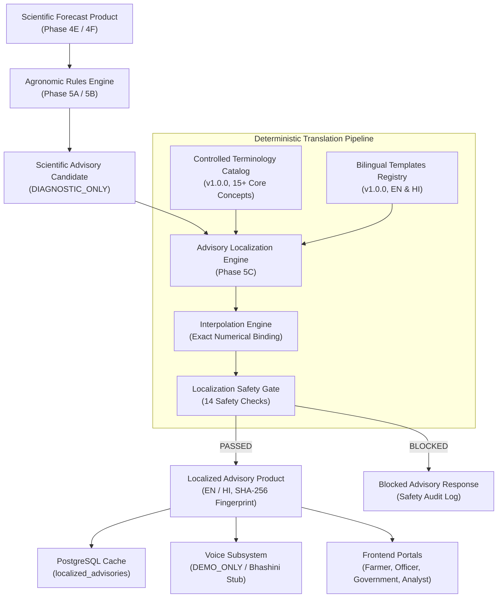

# Multilingual Agronomic Advisory Delivery, Voice Accessibility & Personalization (Phase 5C)

## 1. Executive Summary & Objective

Phase 5C delivers the presentation-layer transformation of VarshaSetu's scientific agronomic advisories into accessible, bilingual, and voice-assisted formats for agricultural communities and regional extension officers. It introduces a **deterministic multilingual localization engine**, an **immutable agro-meteorological terminology catalog**, a **14-point localization safety gate**, and a **controlled acoustic voice demonstration subsystem**.

Adhering strictly to VarshaSetu's scientific integrity principles:
- **No machine-learning hallucination:** Translations are generated exclusively from deterministic, human-vetted bilingual templates. Unconstrained neural translation is prohibited.
- **Zero numerical drift:** Every probability, threshold value, unit, and horizon in the localized output matches the underlying scientific forecast with 0.0% variance.
- **Strict non-prescriptiveness:** All imperative agricultural commands (e.g., spraying instructions, sowing bans, chemical applications) are strictly blocked in both English and Hindi.
- **No yield or financial claims:** Localized outputs cannot mention crop yields, harvest tonnages, profits, or financial losses.
- **Transparent voice accessibility:** Synthetic audio readouts operate in prototype mode (`DEMO_ONLY`) with zero fabricated telecom integration or synthetic credentials.

---

## 2. Architecture & Design Principles



The localization architecture follows a strict separation of concerns:
1. **Source Generation:** Scientific advisories are generated in Phase 5A under `DIAGNOSTIC_ONLY` operational constraints.
2. **Deterministic Translation:** Instead of passing dynamic text through an unconstrained LLM or translation API, the system resolves the specific rule ID (`AGRO_HEAVY_RAIN_INFO_001`, etc.) against versioned templates in `templates.py`.
3. **Safety Verification:** The localized advisory passes through `LocalizationSafetyGate` before any presentation or database persistence.
4. **Voice Dispatch:** Requests for audio readout pass to `VoiceService`, returning `DEMO_ONLY` acoustic metadata and waveform tones.

---

## 3. Controlled Language Registry

The system supports two controlled languages:

| Language Code | Language Name | Native Script | Operational Status | Translation Strategy |
| :--- | :--- | :--- | :--- | :--- |
| **`EN`** | English | English | `ACTIVE` | Master Scientific Reference |
| **`HI`** | Hindi | हिन्दी | `ACTIVE` | Controlled Deterministic Template |

Expansion to additional regional languages (e.g., Bengali, Marathi, Telugu) is designed to follow identical deterministic template structures without architectural modification.

---

## 4. Controlled Terminology Catalog (Version 1.0.0)

To guarantee that meteorological and agronomic terms retain identical meaning across languages without semantic dilution, the system maintains a versioned dictionary:

| Concept Key | English Display Term | Hindi Display Term (देवनागरी) | Category |
| :--- | :--- | :--- | :--- |
| `HEAVY_RAIN` | Heavy Rainfall (>=64.5 mm / 24h) | भारी वर्षा (>=64.5 मिमी / 24 घंटे) | METEOROLOGICAL_HAZARD |
| `DRY_SPELL` | Dry Spell (>=5 consecutive dry days) | शुष्क अवधि (लगातार 5 या अधिक सूखे दिन) | METEOROLOGICAL_HAZARD |
| `EXTREME_RAIN` | Extreme Rainfall (>=204.5 mm / 24h) | अत्यधिक वर्षा (>=204.5 मिमी / 24 घंटे) | METEOROLOGICAL_HAZARD |
| `MONSOON_ONSET` | Monsoon Onset Progression | मानसून प्रारंभ प्रगति | METEOROLOGICAL_FEATURE |
| `FALSE_ONSET` | False Onset Hiatus Risk | असत्य मानसून प्रारंभ व शुष्क विराम जोखिम | METEOROLOGICAL_FEATURE |
| `RAINFALL_DEFICIT` | Substantial Rainfall Deficit | उल्लेखनीय वर्षा कमी | CLIMATIC_ANOMALY |
| `RAINFALL_SURPLUS` | Substantial Rainfall Surplus | उल्लेखनीय वर्षा आधिक्य | CLIMATIC_ANOMALY |
| `WATERLOGGING` | Field Waterlogging Risk | खेत में जलभराव का जोखिम | FIELD_RISK |
| `SOIL_MOISTURE_STRESS` | Soil Moisture Stress | मृदा नमी तनाव | FIELD_RISK |
| `FORECAST_PROBABILITY` | Forecast Probability | पूर्वानुमान संभावना | SCIENTIFIC_METRIC |
| `CALIBRATED_PROBABILITY` | Calibrated Probability | अंशांकित संभावना | SCIENTIFIC_METRIC |
| `HISTORICAL_BASELINE` | Historical Climatological Baseline | ऐतिहासिक जलवायु आधार रेखा | SCIENTIFIC_METRIC |
| `DIAGNOSTIC_ONLY` | Diagnostic Only — Informational Risk Indicator | केवल नैदानिक — सूचनात्मक जोखिम सूचक | GOVERNANCE_DISCLOSURE |
| `HISTORICAL_LIMITATION` | Single-Season Historical Anchor (UP_LKO_BKT, Kharif 2024) | एकल-सत्र ऐतिहासिक आधार (बख्शी का तालाब, खरीफ 2024) | GOVERNANCE_DISCLOSURE |
| `CROP_PADDY` | Paddy (Rice) | धान (चावल) | AGRONOMY_CROP |

---

## 5. Deterministic Bilingual Templates

Bilingual templates cover all 9 registered Phase 5A agronomic rules:

### Example: Heavy Rainfall Risk Indicator (`AGRO_HEAVY_RAIN_INFO_001`)

- **English Reference:**
  - *Title:* Heavy Rainfall Risk Indicator
  - *Summary:* Heavy rainfall risk indicator detected for the {horizon_days}-day forecast window. Model forecasts indicate a {probability_pct}% calibrated probability of 24h rainfall exceeding 64.5 mm.
  - *Risk Indicator:* Watch: Potential 24-hour rainfall exceeding 64.5 mm.
  - *What It Means:* Atmospheric indicators show heightened probability of significant rainfall within the next {horizon_days} days. Ground fields may experience localized surface saturation.
- **Hindi Reference:**
  - *Title:* भारी वर्षा जोखिम सूचक
  - *Summary:* आगामी {horizon_days} दिनों की पूर्वानुमान अवधि के लिए भारी वर्षा जोखिम सूचक सक्रिय है। मॉडल पूर्वानुमान 24 घंटे में 64.5 मिमी से अधिक वर्षा की {probability_pct}% अंशांकित संभावना दर्शाते हैं।
  - *Risk Indicator:* निगरानी: 24 घंटे में 64.5 मिमी से अधिक वर्षा की संभावना।
  - *What It Means:* मौसम के संकेतक आगामी {horizon_days} दिनों के भीतर महत्वपूर्ण वर्षा की बढ़ी हुई संभावना दर्शाते हैं। खेतों में स्थानीय जलभराव की स्थिति बन सकती है।

### Exact Number Preservation
Variables `{horizon_days}`, `{probability_pct}`, `{departure_pct}`, and `{confidence_status}` are strictly bound from the input scientific forecast evidence. For instance, `58.4%` in the English forecast renders as `58.4%` in Hindi, with 0.0% truncation or modification.

---

## 6. Localization Safety Gate (14 Automated Checks)

Before any localized advisory is transmitted or stored, `LocalizationSafetyGate` executes 14 automated validation checks:

```
[LocalizationSafetyGate]
  ├── Imperative Command Verbs Rejection
  │     ├── English: spray, apply, sow, plant, harvest now, do not sow, irrigate immediately, buy, sell, guarantee, must
  │     └── Hindi: छिड़काव करें, खाद डालें, बोआई करें, बोआई न करें, तुरंत सिंचाई करें, फसल काटें, दवा डालें, गारंटी, खरीदें, बेचें
  ├── Ungrounded Yield & Biomass Claims Rejection
  │     ├── English: yield, biomass, production loss, tonnes per hectare, quintal, crop loss
  │     └── Hindi: उपज, पैदावार, उत्पादन हानि, क्विंटल, फसल नुकसान, बायोमास
  ├── Financial & Revenue Claims Rejection
  │     ├── English: revenue, profit, monetary loss, rupees, inr, ₹, $
  │     └── Hindi: रुपये, मुनाफा, आमदनी, वित्तीय हानि, ₹, पैसा
  └── Numerical Drift Verification
        ├── Probability Metric Equality (exact numerical match between evidence & localized text)
        ├── Threshold Metric Equality (e.g. 64.5mm == 64.5 मिमी)
        └── Temporal Horizon Equality (e.g. 7 days == 7 दिन)
```

Any violation immediately halts localization and issues an HTTP 422 `LocalizationSafetyViolation` response.

---

## 7. Voice Accessibility Subsystem

The Voice Subsystem enables auditory consumption of advisories for non-literate or visually impaired users:

- **Active Provider:** `MOCK_LOCAL_VOICE_ENGINE`
- **Operational Mode:** `DEMO_ONLY`
- **Output Formats:** Valid PCM WAV acoustic tone metadata with Base64 payload, plus client-side `SpeechSynthesisUtterance` fallback.
- **Speed Adjustment:** Configurable speech rate `[0.8x, 1.0x, 1.2x]`.
- **Bhashini Integration Stub:** `BHASHINI_GOV_IN` reports status `NOT_CONFIGURED` gracefully when external government API credentials are not provided. Fabricated API keys and fake external telemetry are strictly avoided.
- **Telecom Non-Distribution:** SMS, IVR, WhatsApp broadcasts, and carrier telephony are explicitly disabled and classified out-of-scope for Phase 5C.

---

## 8. Database Architecture

Migration `011_multilingual_advisory_delivery.sql` establishes three dedicated tables:

### 1. `localized_advisories`
Persists verified translations to eliminate redundant processing and enable cryptographic auditing:
- `id` (UUID, PK)
- `advisory_id` (VARCHAR(100), Indexed)
- `language` (VARCHAR(10), CHECK 'EN' | 'HI')
- `title` (VARCHAR(255))
- `summary` (TEXT)
- `risk_indicator` (TEXT)
- `what_it_means` (TEXT)
- `evidence` (JSONB)
- `confidence_statement` (TEXT)
- `disclosure` (TEXT)
- `historical_limitation_disclosure` (TEXT)
- `classification` (VARCHAR(50), default 'DIAGNOSTIC_ONLY')
- `translation_method` (VARCHAR(50), default 'CONTROLLED_TEMPLATE')
- `template_version` (VARCHAR(20), default '1.0.0')
- `terminology_version` (VARCHAR(20), default '1.0.0')
- `localization_fingerprint` (VARCHAR(64), Indexed)
- `created_at` (TIMESTAMPTZ)
- `CONSTRAINT uq_localized_advisory_lang UNIQUE (advisory_id, language)`

### 2. `advisory_reads`
Records user read receipts and acknowledgements:
- `id` (UUID, PK)
- `advisory_id` (VARCHAR(100), Indexed)
- `user_id` (UUID, REFERENCES users(id))
- `language` (VARCHAR(10), default 'EN')
- `device_channel` (VARCHAR(50), default 'WEB_PORTAL')
- `read_at` (TIMESTAMPTZ)

### 3. `voice_synthesis_logs`
Logs audio requests for system performance telemetry:
- `id` (UUID, PK)
- `advisory_id` (VARCHAR(100))
- `language` (VARCHAR(10))
- `provider` (VARCHAR(50))
- `status` (VARCHAR(50))
- `duration_seconds` (NUMERIC(6,2))
- `requested_at` (TIMESTAMPTZ)

---

## 9. API Specifications

### `GET /api/v1/advisories/languages`
Returns the active language catalog and policy disclaimer:
```json
{
  "supported_languages": [
    { "code": "EN", "name": "English", "native_name": "English", "status": "ACTIVE" },
    { "code": "HI", "name": "Hindi", "native_name": "हिन्दी", "status": "ACTIVE" }
  ],
  "default_language": "EN",
  "translation_engine": "CONTROLLED_DETERMINISTIC_TEMPLATES",
  "terminology_version": "1.0.0"
}
```

### `GET /api/v1/advisories/terminology`
Returns the immutable agro-meteorological glossary (15+ terms).

### `POST /api/v1/advisories/localize`
Localizes an advisory into English or Hindi, validating safety and preserving numbers.

### `GET /api/v1/advisories/:id/localized?lang=HI`
Retrieves a cached localized advisory or generates it deterministically.

### `POST /api/v1/advisories/:id/read`
Records a read receipt acknowledgement for the authenticated user.

### `GET /api/v1/voice/status`
Returns consolidated voice provider health:
```json
{
  "active_provider": "MOCK_LOCAL_VOICE_ENGINE",
  "status": {
    "provider": "MOCK_LOCAL_VOICE_ENGINE",
    "status": "DEMO_ONLY",
    "configured": true
  },
  "system_mode": "DEMO_ONLY",
  "telecom_integration": "DISABLED"
}
```

### `POST /api/v1/advisories/:id/voice`
Synthesizes demonstration speech for the advisory in the target language.

---

## 10. User Experience Portals

### 1. Farmer Portal (`/farmer/advisories`)
- Controlled bilingual switcher (`[English] [हिन्दी]`).
- Voice audio readout button with speed controls (`0.8x`, `1.0x`, `1.2x`) and transparent demo notice.
- "Mark as Read / पढ़ा हुआ चिह्नित करें" interaction tracking user acknowledgement.
- Expandable terminology glossary drawer explaining core agro-meteorological concepts.
- Dual scientific disclosures (standard advisory disclaimer + single-season ground anchor limitation).

### 2. Officer Portal (`/officer/advisories`)
- Bilingual review mode allowing extension officers to inspect English and Hindi side-by-side.
- Safety Gate enforcement indicator ("Localization Safety: PASSED").

### 3. Government Command Portal (`/government`)
- Multilingual Delivery Readiness Card reporting:
  - Supported Languages: English & हिन्दी
  - Translation Engine: CONTROLLED_TEMPLATES v1.0.0
  - Terminology Catalog: 15+ Core Concepts
  - Voice Mode: DEMO_ONLY (No ungrounded telecom claims)

### 4. Forecast Lab (`/analyst/lab`)
- Dedicated **Advisory Localization & Voice Lab** tab.
- Side-by-side English vs Hindi text comparison.
- 6-point Semantic Invariance & Numerical Fidelity Audit checklist with live verification badges.
- Voice Subsystem inspector showing mock provider telemetry and Bhashini `NOT_CONFIGURED` status.

---

## 11. Ground Anchor & Scientific Boundary

- **Geographic Centroid:** Bakshi Ka Talab (`UP_LKO_BKT`), Lucknow District, Uttar Pradesh.
- **Temporal Anchor:** Kharif 2024 season (June 1, 2024 – September 30, 2024; 122 daily observational records).
- **Operational Classification:** Strictly `DIAGNOSTIC_ONLY`.
- **Agricultural Boundary:** Presentation-layer localization does not alter rule logic, evidence values, or thresholds. No crop interventions, yield projections, or financial risk assessments are certified.

---

## 12. Verification & Test Suite Summary

Phase 5C implementation has been fully tested across all three tiers:

- **ML Service (`pytest`):** 174 tests passing (16 new Phase 5C unit tests).
- **Backend Service (`vitest`):** 85 tests passing (5 new Phase 5C integration tests).
- **Frontend Portal (`vitest`):** 61 tests passing (9 new Phase 5C component & service tests).
- **Total Workspace Tests:** **320 / 320 tests passing (100% pass rate)**.
