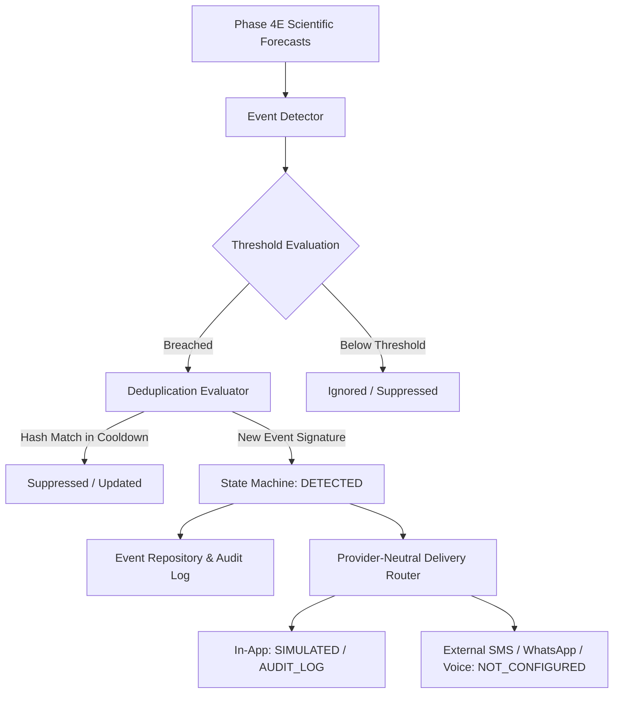
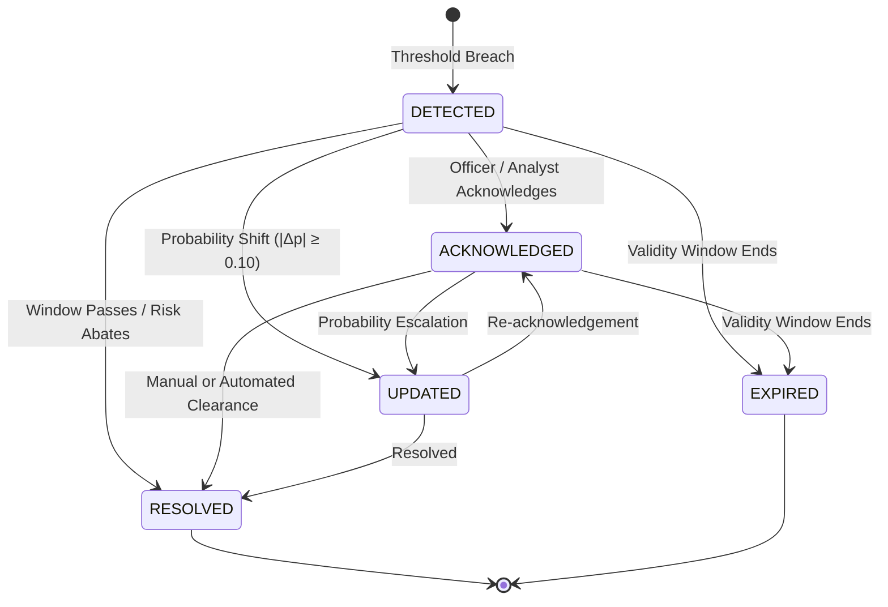

# Phase 4F: Operational Alerting, Event Intelligence & Deduplication

## 1. Overview & Operational Purpose

VarshaSetu's Phase 4F Alert Intelligence subsystem provides deterministic, threshold-driven meteorological event detection and delivery orchestration for hyperlocal forecast products.

The subsystem sits between scientific forecast generation (Phase 4E) and downstream dissemination channels. It detects meteorological threshold breaches (e.g. heavy rainfall, dry spells, onset surges, false onset breaks), assigns severity tiers, prevents alert fatigue through cryptographic deduplication and cooldown windows, and manages a formal event lifecycle.

In adherence to VarshaSetu's scientific honesty principles:
- All events are evaluated on the historical Kharif 2024 archive (`UP_LKO_BKT`).
- Operational status is strictly gated to `DIAGNOSTIC_ONLY`.
- External carrier broadcasting (SMS, WhatsApp, Voice/IVR) is intentionally disabled (`NOT_CONFIGURED`), operating strictly in simulated and audit-logged mode.
- Agronomic decision directives (such as "sow now" or "spray immediately") are strictly excluded from this meteorological detection layer and reserved for Phase 5.

---

## 2. Event Detection Architecture



### Event Detection Criteria

| Event Type | Target Mapping | Trigger Threshold | Severity Tiers | Description |
| :--- | :--- | :--- | :--- | :--- |
| `HEAVY_RAIN_RISK` | `HEAVY_RAIN` | Calibrated Prob $\ge 0.40$ or Rain $\ge 64.5$ mm | `WATCH` ($\ge 0.40$), `WARNING` ($\ge 0.65$), `CRITICAL` ($\ge 0.85$) | Risk of 24h rainfall exceeding IMD heavy rain threshold (64.5 mm) |
| `EXTREME_RAIN_RISK` | `HEAVY_RAIN` / `RAINFALL_AMOUNT` | Expected Rain $\ge 204.5$ mm or Prob $\ge 0.90$ | `CRITICAL` | Risk of catastrophic rainfall exceeding IMD extreme threshold (204.5 mm) |
| `DRY_SPELL_RISK` | `DRY_SPELL` | Calibrated Prob $\ge 0.45$ ($\ge 5$ consecutive dry days) | `WATCH` ($\ge 0.45$), `WARNING` ($\ge 0.70$) | Risk of sustained dry spell impacting soil moisture regimes |
| `MONSOON_ONSET_RISK` | `MONSOON_ONSET` | Calibrated Prob $\ge 0.50$ | `INFO` ($\ge 0.50$), `WATCH` ($\ge 0.75$) | Early indicator of atmospheric onset criteria fulfillment |
| `FALSE_ONSET_RISK` | `MONSOON_ONSET` + `DRY_SPELL` | Onset Prob $\ge 0.60$ followed by Dry Spell $\ge 0.50$ | `WARNING` | High probability of initial rainfall surge followed by immediate hiatus |
| `RAINFALL_ANOMALY` | `RAINFALL_AMOUNT` | Departure from climatological normal $\ge \pm 50\%$ | `INFO` ($\pm 25\%$), `WATCH` ($\pm 50\%$), `WARNING` ($\pm 75\%$) | Significant deviation from 30-year climatological normals |

---

## 3. Cryptographic Deduplication & Cooldown Windows

To prevent alert fatigue and notification flooding when forecasts are regenerated on identical inputs:

1. **Deterministic Fingerprint Hash (`dedup_hash`):**
   ```
   SHA256(block_id : event_type : target_type : horizon_days : threshold : valid_from : valid_until)[:16]
   ```
2. **Cooldown Evaluation:**
   - Default cooldown window: **24 hours**.
   - If an existing event with identical `dedup_hash` is in `DETECTED`, `ACKNOWLEDGED`, or `UPDATED` within the cooldown window:
     - If the probability change $|\Delta p| < 0.10$ and severity is unchanged, the event is marked `SUPPRESSED` and no duplicate record is created.
     - If the probability has shifted by $|\Delta p| \ge 0.10$ or severity escalated, the event state transitions deterministically to `UPDATED`.

---

## 4. Event Lifecycle State Machine

Events transition deterministically through five states:



Every transition is recorded with timestamp, triggering actor, reason, previous state, and new state in PostgreSQL `forecast_event_transitions` and disk audit logs (`ml-service/artifacts/events/`).

---

## 5. Delivery Channel Abstraction

VarshaSetu uses a provider-neutral notification abstraction (`NotificationDeliveryProvider`) with zero external carrier lock-in:

| Channel | Interface | Implementation Status | Safety Guard |
| :--- | :--- | :--- | :--- |
| **In-App** | `ConsoleDeliveryProvider` / `DatabaseDeliveryProvider` | `SIMULATED` | Persisted to PostgreSQL `notification_deliveries` and JSON logs. |
| **Email** | `NotificationDeliveryProvider` | `NOT_CONFIGURED` | Blocked under `DIAGNOSTIC_ONLY` operational status. |
| **SMS** | `NotificationDeliveryProvider` | `NOT_CONFIGURED` | Telecommunications broadcasting strictly disabled. |
| **WhatsApp** | `NotificationDeliveryProvider` | `NOT_CONFIGURED` | Meta Business API unconfigured; outbound messaging blocked. |
| **Voice / IVR** | `NotificationDeliveryProvider` | `NOT_CONFIGURED` | Outbound telephony unconfigured; no voice broadcast calls. |

---

## 6. Scientific Communication Guidelines

All generated event alerts follow strict non-alarmist communication rules:
1. **Probabilistic Realism:** Express risks as probabilities and thresholds, not certainties (e.g. *"78% probability of 24h rainfall exceeding 64.5 mm"*).
2. **Non-Alarmist Phrasing:** Avoid sensationalist language (*"Devastating deluge incoming"*); use objective meteorological classifications (*"Heavy Rainfall Risk — IMD Threshold Watch"*).
3. **Agronomic Gating:** Never include agronomic directives (*"Farmers must sow immediately"*) in meteorological alerts. Agronomic translations belong exclusively to Phase 5.
4. **Diagnostic Notice:** Every alert includes the disclaimer: *"Diagnostic meteorological model output based on Kharif 2024 archive. Operational alerting is inactive."*
